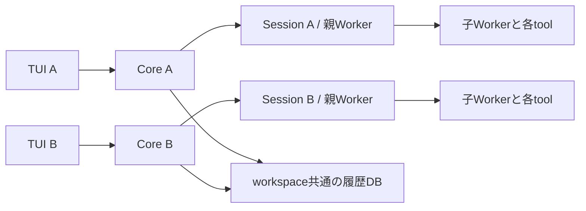

# A25 — 同じworkspaceで複数Coreを動かす案

2026-09-28。利用者指定の複数Core構成を、操作、状態所有、変更範囲、確認方法までまとめる。
構成比較と現行Coreの実測は実施済み。追加の利用者指示により五sliceのlocal実装・reviewを採用した。
現在の要件・実装・確認結果は[実装計画](a25-implementation-slices.md)とIncrement 149〜153を参照する。
2026-09-29に利用者が完了承認し、関連文書更新・commit/push・常用配置を指示した。
常用配置・配置後確認を完了した。配置状態は[合同配置記録](../increments/a25-deployment-2026-09-29.md)を参照する。
構想、architecture、roadmapの正本へ反映する意味上の変更案は末尾に示す。

## 必要な動作と選択理由

同じcanonical workspace・同じXDGで、独立したSessionの作業を並行実行できるようにする。
通常の`henji`は毎回新しいCoreと新規Sessionを起動し、TUIを接続する。
生存中のCoreへ戻るときは接続先を明示する。保存Sessionの再開と、生存Coreへの再接続を区別する。
利用者はこの通常起動方針を選び、一Core複数Session案との比較・実測を経て複数Core案の整理を指示した。

複数Coreを選ぶ理由は、独立した作業の起動・停止・process環境・buildの単位を揃えられることと、
現行Coreの一稼働Sessionという構造を利用できることである。
gpt-6-astraへの再相談でも、現要件に対して同構成を推奨した。
一endpointから複数Sessionを頻繁に切り替える利用が中心になれば、一Core複数Sessionを再評価できる。
統一endpointとprocess独立性が両方必要なら、共通gateway＋Session別Coreにも利点があるが、
現在の目的にはroutingと二段のlifetime管理を増やす理由がない。

Coreの数とAgent間協調は別の軸である。今回の案は独立作業の並行利用を扱い、swarmを採用する判断ではない。

## 利用者の操作案

新しいoptionの表記と対象省略時の挙動は、以下を計画案とする。

| 操作                                     | 結果                                                                            |
| ---------------------------------------- | ------------------------------------------------------------------------------- |
| `henji` / `henji tui`                    | 新Core・新Sessionを作り、そのTUIを開く                                          |
| `henji --core <id>`                      | 現在workspaceの指定Coreへ接続し、その稼働Sessionを表示する                      |
| `henji tui --connect <url>`              | 指定HTTP Coreへ接続する既存の経路                                               |
| `henji core list [--json]`               | 現在workspaceのCoreを一覧表示。実行やSession切替は行わない                      |
| `henji core status`                      | 現在workspaceのCore一覧と状態を表示する                                         |
| `henji core status --core <id>`          | 指定Core一つの状態を表示する                                                    |
| `henji core stop --core <id>`            | 指定Core一つだけをHTTP shutdownで停止する                                       |
| `henji core status/stop --connect <url>` | URLで指定したCoreの既存操作                                                     |
| `henji serve [--json]`                   | 毎回新しいheadless HTTP Coreを起動する。Sessionの初期openは既存の明示指定に従う |
| `henji --session <session-id>`           | 新Coreで保存Sessionを明示再開する                                               |
| `henji --core <id> --new`                | 選択したCore内で新規Sessionへ切り替える既存のidle時操作                         |

`--core`のIDはCore epoch UUIDを使い、人間は一覧に表示された識別可能なprefixを指定できる案とする。
prefixが複数Coreに一致すれば候補を表示して選択を求める。PIDは表示情報であり、永続identityにはしない。
`--core`と`--connect`は同じ接続先指定の二表現として整理し、一度に一接続先を指定する。
接続先指定がない起動では既定Coreや最後に使ったCoreを自動選択しない。
指定Coreが停止済みならその状態を伝え、同じIDで新しいCoreを暗黙起動しない。

対象を省略した`core stop`は、一覧と対象指定方法を表示し、停止操作を行わない案とする。
複数Coreのどれを止めるか決まらないためであり、workspace全体の一括停止機能は今回加えない。
一覧には短いCore ID、PID、workspace、Session ID/titleまたは未open、phase、URLを表示する。
Coreがlockを所有するがHTTP応答を確認できない状態は、既存statusのunreachable表現をCoreごとに扱う。

TUIの起動表示に接続中の短いCore IDを加え、Session表示と合わせて操作先を判断できるようにする。
複数TUIが同じCoreへ明示接続することも可能とし、draftやviewportは各clientに属する既存構造を使う。
`--new`、`--continue`、`--session`、`--no-session`はSession選択であり、Core選択とは別に扱う。

## 状態の所有とlifetime

一Coreは一つのcanonical workspaceと一つの稼働Session slotを持つ。 slotには一root
Executionがあり、その親に属するasync childとtoolは既存経路で実行する。 Core AとCore
BはそれぞれのSession、Worker、command受付、購読、processを所有する。



TUI detachは受付済み実行やCoreを止めない。 親Executionのcancelは、その親と子、および対応するtool
processを対象にする。 Core stopは選択したCoreのWorker、子、process、history、listener、discovery
ownershipを清算する。 他Coreの同名Agent、tool、Sessionを対象にしない。
同じ保存Sessionの二重writerには、既存のSession単位lockを使う。
Core数を増やすことと、同一Sessionへ複数writerを許すことを同一視しない。

保存Session、canonical/noncanonical履歴、Execution ID、親子関係はworkspace共通DBに属する。 model
selectionは各Sessionのstate、新規Sessionの既定は共有default-selectionの既存経路を使う。
config、credential/profile、managed resourceも既存の共有XDG経路を使い、
processが別であることを保存先の分割や稼働Session間の設定同期へ置き換えない。

同じworkspace fileへの編集は実際に同じfileへ作用する。自動編集調停は今回の範囲に含めない。
子Agentの管理は各Core内の親Executionに属し、Core間のmailboxや結果回収機構は今回加えない。

## 現行経路と変更の中心

通常起動は、`henji_cli` → `tui_cli` → `remote_tui_cli` → `prepareLocalCore` → detached bootstrap →
`serve_cli` → `createCoreService` → HTTP/SSE → remote TUI。
現行discoveryはworkspaceごとにendpoint、startup lock、instance lock、boot結果を一組持ち、
通常TUIとserveは生存Coreを再利用する。これが通常launcherで二Coreを起動できない中心である。

変更後は、launcherが新Coreのepoch UUIDを起動前に採番し、Core単位のdiscoveryへ渡す案とする。
既存coreEpochを表示・runtime識別にも使い、Core終了後も存続する別のdurable Core
identityは増やさない。 bootstrap、Core service生成、ready確認、HTTP
epoch、終了時のmetadata対象まで同じepochを渡す。 既存bootstrap
tokenは起動結果の相関として扱い、Session IDやCore identityと役割を混ぜない。

```text
stateRoot/cores/<workspaceDigest>/<coreEpoch>/
  endpoint.json
  startup.lock
  instance.lock
  boot.json

stateRoot/<workspaceDigest>/history-v7.sqlite3
```

endpoint・lock・boot結果はCoreごと、DBとSession lockはworkspaceごとの既存配置とする。
list/status/明示接続はCoreのdirectoryを発見・照会する。終了処理はそのCoreのmetadataとlockを扱う。
workspace単位の単一endpoint探索と既定Core自動再利用は、新しい起動経路から外す。
古いendpointのdual-read、default Core pointer、履歴DB migration、既存data削除は計画しない。
常用配置時に生存中の旧Coreをどう切り替えるかは、配置段階で別途扱う。

既存`henji run`は`runtime_cli` → `runHeadlessWorker`の独立したheadless実行経路であり、
workspaceのHTTP Core discoveryへ合流しない。今回HTTP Coreへ付け替えず、stdout・exit
codeの契約を保つ。 外部AgentがHTTP
Coreを使う場合は、新Coreをserveし、ready出力のURL/epochを使って操作する。
呼び出しの完了・cancel・Core shutdownを外部callerが区別できる。

主な対象は`core_discovery.ts`、`serve_cli.ts`、`core_cli.ts`、`remote_tui_cli.ts`、
`henji_cli.ts`のbootstrap入口、CLI helpと操作文書、TUIの接続先表示、下記の共有DB経路。 Core
serviceの単一slot、親子Workerのloop、Session指定HTTP API/SSEは既存構造を利用する。

## 共有DBの対応範囲

二Core・二Session・親子Executionの保存は実測で成立している。
一方、二Coreで必要になる次の経路を同じ変更範囲に含める。

利用者指定（2026-09-28）により、最終的な旧DBの移行・互換性維持は不要とする。
現時点ではschema・履歴形式の変更を想定していないが、旧DBの引継ぎを理由に実装を制約しない。
旧DB変換や互換read/writeを追加せず、既存dataの削除は今回の指示に含めない。

| 対応                           | 根拠と利用者への影響                                                                                                                                | 対応案                                                                                    |
| ------------------------------ | --------------------------------------------------------------------------------------------------------------------------------------------------- | ----------------------------------------------------------------------------------------- |
| DBの新規作成を別Coreで認識     | DB未作成時に起動したBが、Aの保存後も一覧0となる挙動を実再現                                                                                         | 一覧・履歴queryのDB存在判定を更新する                                                     |
| 各write接続の待機設定          | helper接続にはbusy_timeout=250、semantic append用長寿命接続には設定なし。別SessionでもDB writerは共有                                               | write接続で待機を揃える。初期候補5秒を実経路で評価し、全operation retryは追加しない       |
| 初回schema作成とread-only open | 二writerがtransaction前にversion 0を読む経路と、DB file作成後・schema commit前に別Coreがread-only openしてversion 0で起動失敗する経路がsourceにある | writer取得後のversion再判定に加え、Coreのread-only openも初期schemaのcommit完了後に進める |
| recovery取得lockの解放         | active一覧取得後に元Executionがsettledになった場合、early returnがlock解放finallyを飛ばすsource経路がある                                           | 取得したlockをその処理の終了時に解放する                                                  |

初回openには、workspace DBのschema初期化を同期する境界を設ける。 writerはDB
fileを作る前に初期化の所有を取得し、writer transaction取得後にversionを再判定する。
必要なschema作成をcommitしてから初期化の所有を解放する。 Coreのread-only
history初期化もこの境界を通り、実行中の初期化が完了してからDBの存在とschemaを確認して開く。
起動時の`ensureHistory`と、起動後に別Coreが作成したDBを初めて開く経路の両方を対象とする。 DB
fileの存在だけをschema準備完了と扱わず、read-only側によるDB新規作成や全operation retryは追加しない。
この初期化同期は、稼働Sessionの既存writer lockとは別の責務として扱う。

案作成時点では、上の待機不足、同時schema作成・read-only open、recovery
lock残留はsourceに基づく調整事項だった。 実装中に並行保存の `history_io_failure`
を観測し、短いwriter保持中の待機とschema同期・recovery lock解放を確認した。
変更後の実行結果は[149](../increments/increment-149.md)・[150](../increments/increment-150.md)を参照する。
待機5秒は調査したOpenCode/Codexの接続設定を初期参考とする判断で、今回の負荷実測から導いた値ではない。
生存CoreのSessionを起動時recoveryがinterrupted扱いしない既存lock判定を利用する。

## 確認済みの根拠

source調査は`c5ad9c72e2298f72302723cd6bda4182269536f3`時点。

1. 常用binaryのserve二回は、同じPID/epoch/URLへ合流した。
2. production Core serviceを別PIDで二つ起動し、toolなしの実provider taskが並行に完了。 同じWAL
   DBへの両canonical保存と履歴readbackを確認した。物理requestは計2。
3. 二Coreそれぞれの親・子Agentがbashを実行し、四つのbashの同時生存をPIDで確認した。 Aの親cancelとA
   Core shutdownの二caseでAの親・子bashが停止し、Bの親・子bashは同じPIDで継続した。
   Bはcollect成功、親completed/canonical、processSettlement
   complete、DB保存・履歴readbackまで成功した。
   本確認18request、調査指定のtool名訂正前8request、計26。

3のshutdown時、停止したA親はfailed/contract_failure（Worker host session
closed）、子はcancelledと記録された。
停止後の履歴の分類として追加観測を残す。複数Core固有の問題とは確認しておらず、
分類変更をA25の必須修正として推測で追加しない。

これらの実測はsingleton discoveryだけを調査入口から迂回したもの。
通常CLIの複数Core起動、TUIの接続先表示、Core list/明示選択まで成立した証拠ではない。
調査用Coreは停止済み、credentialコピーは削除済み。raw provider
payloadやAuthorizationは記録していない。

証拠と調査scriptは次を参照する。

- [参照実装と実測の詳細](/tmp/codex-agent-context/a25-multiple-cores/research.md)
- [二Core・親子Agent・bashの結果](/tmp/codex-agent-context/a25-multiple-cores/probe/children-20260928-201858/result.md)
- [astraによる三構成の比較](/tmp/codex-agent-context/a25-multiple-cores/comparison.md)

参照実装はPi `e1787702…`、OpenCode `03e67171…`、Codex `44fe510c…`の公開sourceを固定して調査した。
Pi/OpenCodeの通常起動ごとのruntime、明示attach、Codexの埋込み/共有daemonとthread単位writer
lockを参考にする。 どの製品も一Core一Sessionの別PID方式に固定されているとは要約しない。

- [Piの通常CLI](https://github.com/earendil-works/pi/blob/e1787702d32e0a7fd7387840c918faa4d1286187/packages/coding-agent/src/main.ts#L357)
- [OpenCodeのTUI起動](https://github.com/anomalyco/opencode/blob/03e67171ab2dc1e7f16e8cebfbc7f778f61b89f0/packages/opencode/src/cli/cmd/tui.ts#L210)
- [CodexのApp Server選択](https://github.com/openai/codex/blob/44fe510ce3ee61c8ef623adcbf89b901c73ddd61/codex-rs/tui/src/lib.rs#L1013)
- [CodexのThread writer lock](https://github.com/openai/codex/blob/44fe510ce3ee61c8ef623adcbf89b901c73ddd61/codex-rs/rollout/src/writer_lock.rs#L43)

## 案のreviewと修正

gpt-6-astraの初回reviewは通常passがBlocking 0・P1 0、批判的passがBlocking 0・P1 1だった。
採用したP1は、writer同士の初回schema作成対策だけでは、別Coreのread-only起動失敗を防げない点。
共有DBの対応案を上記の初期化同期へ修正し、下記の完了確認にschema commit前のCore起動を加えた。
review時点では計画への反映だった。実装後のprocess間barrierによる確認結果は
[149](../increments/increment-149.md)を参照する。
初回reviewの対象と結果は[review記録](/tmp/codex-agent-context/a25-review/result.md)を参照する。

## 実装へ進む場合の作業分割と完了確認

利用者の追加指定により、実装計画は五sliceへ分ける。
順序、各sliceの利用動作・変更範囲・受入、統合確認は
[複数Coreの実装計画](a25-implementation-slices.md)を参照する。
初回DB同期、共有DBの継続利用、新Core起動、Core管理、TUIの明示接続・表示の順に進める。

成功基準は、同じworkspaceの二terminalで引数なしhenjiを起動すると別PID/epoch/Sessionとなり、
両方のtaskを並行に完了できること。明示接続で選んだ生存Coreへ戻れ、保存履歴が共通DBから読めること。
片方のTUI detach、親cancel、個別Core stopが、もう片方の作業を終了させないこと。 Core
listとTUI上の表示から、人間が接続先・停止先を判別できること。

初回DB作成の確認では、AがDB fileを作成してschema transactionをcommitする前にB Coreを起動する。
Bは初期化完了を待って正常に起動し、commit後のschemaで履歴を読み、新しいSessionを利用できること。
この受入経路は実装後に確認した。[149](../increments/increment-149.md)を参照する。

focused testは変更された起動・選択・所有・DBの具体的な動作に対応させる。 type
check、format、lint、git diff --checkと、隔離XDG・tmuxでのproduction TUI確認を行う。
実provider確認は通常launcherの二Coreで行い、対象・見込み量・保存先を実行前に提示する。
実装途中にfull
gateを繰り返さず、採用するincrement計画で要求する場合は安定候補へownerが一回実行する。

## 正本への反映案と承認境界

今回まとめるのは複数Coreの計画案と、通常利用メモからのpointerである。
採用時には要件・計画・結果を個別incrementへ置き、通常利用メモのA25をそこへ移す。

| 文書         | 反映する意味上の変更案                                                                                                                         | 理由                                                          |
| ------------ | ---------------------------------------------------------------------------------------------------------------------------------------------- | ------------------------------------------------------------- |
| architecture | Coreのworkspace scope、一稼働Session、同workspace複数Core、Coreごとの子/tool所有と共通履歴、通常起動と明示接続の境界を記述                     | Core lifetimeと状態所有を正本で説明するため                   |
| roadmap      | 独立Sessionの並行利用、新Core起動・一覧・再接続・個別停止をIncrement149〜153で実装済みとして位置付ける。既存Fへの対応か追加Fかは反映時に決める | 必要機能と実装状態を区別するため                              |
| concept      | 現時点で意味変更案なし                                                                                                                         | 独立作業と交換可能なSurfaceの方向性を既存構想で説明できるため |

architecture・roadmapへの反映は、対象と上記意味変更を提示して別途明示承認を得る。
計画案の文書化は、実装、commit/push、常用配置、公開、既存data削除の承認とは扱わない。
