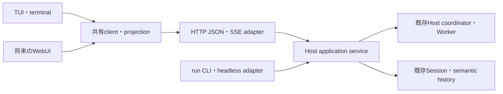
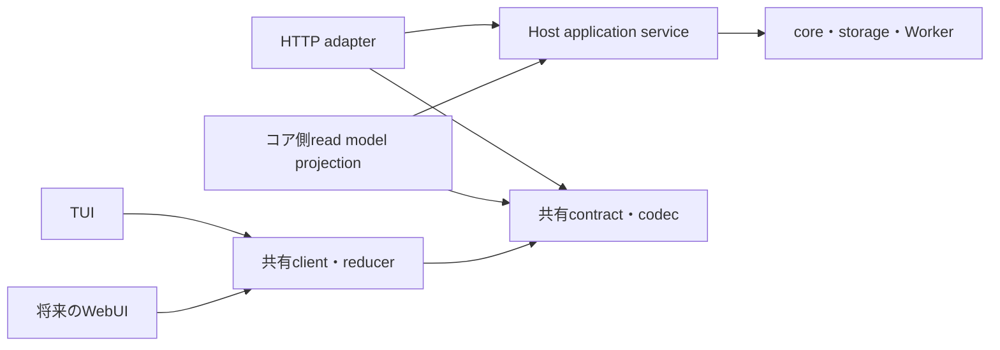

# S22 — 独立HTTPコア・TUI分離の詳細設計と段階実装計画

更新日: 2026-09-28

ステータス: 利用者が全8sliceの段階実装と各sliceのコード・test第三者reviewを指示した。
各sliceを個別incrementで実装・確認する。一括実装の計画にはしない。
現在の実装・検証結果は[Increment 139（Slice 1）](../increments/increment-139.md)と後続incrementを参照する。
S22の8sliceと追加修正147のlocal実装・検証・独立reviewを完了した。現在の配置結果は
[合同配置記録](../increments/s22-deployment-2026-09-28.md)、利用方法は[HTTP API](../operations/http-api.md)を参照する。

## 目的・根拠・今回の判断範囲

人間は独立したコアにTUIで接続し、依頼、進捗の確認、実行中の入力、Session操作を行える。
TUIを閉じても、受付済みの実行とfollow-upはコアで継続する。
再接続すると、保存履歴、実行状態、途中本文・thinking、受付済みpendingを復元できる。
将来のWebUIは同じ操作契約とclientを利用し、terminal固有の操作だけを別に実装する。

根拠は利用者のS22要望、schema／core／UIの整合を重視する補足、
2026-09-27の「詳細設計へ進み、適切なsliceに分ける」指示である。 source確認基準はHenji commit
`c4da8f7956d5152f739c868c38f6ca25f1903388`。 今回の設計作成ではprovider callやproduction
TUIを実行していない。

- [設計検討](s22-http-core-and-tui.md): 議論、現行経路、比較の背景。
- [参照実装調査](../research/s22-agent-client-server-comparison.md): 固定revisionでの静的調査。
- [検討文書のreview](../research/s22-design-review-results.md):
  通常・批判的・astraの結果。対象は詳細設計前の検討文書。
- [詳細設計のreview・対応](../research/s22-detailed-design-review-results.md):
  通常・批判的reviewで採用した2件を本設計へ反映した。修正版の追加review結果も同記録へ残す。
- [architecture](../architecture/henji-host-agent-worker.md)、[roadmap](../roadmap.md):
  状態所有と現行機能の正本。この文書は変更案を保持し、両正本を先に変更しない。

以下の具体的なUX、scope、APIは詳細設計の提案値である。
実装採用時に個別incrementへ移し、sliceごとの範囲・結果を管理する。
WebUI本体、ACP、mailbox、schedule、durable
AgentInstance、コア再起動後の途中実行の自動継続は含めない。
未実装の手動compaction開始も今回の移設対象には含めず、別採用とする。 既存automatic
compactionとcheckpointの表示・再開適用は維持する。

## 到達する操作経路



この図は呼出し経路である。`henji run`のstdout・exit codeは既存CLI adapterが所有し、
HTTP／SSEのpayloadをそのままCLI出力へ流さない。 HTTP adapterは新しいagent
loopを持たず、既存Host／Worker・履歴経路を使う。

実装上のimport依存は次の方向に固定する。



application serviceは具体的なHTTP adapter、client、TUIをimportしない。 read model
projectionはserviceのquery／観測portを利用する。 serviceが公開する観測portはdata-onlyであり、HTTP
response、terminal、rendererを含めない。 既存core内のPresentation
error等の中立な共用値は、移管箇所で中立moduleへ置く。 これを理由に全coreの型をAPI
DTOへ置き換えない。

## scopeと起動UXの提案

### 一つのコアが扱う範囲

一つの`serve`コアは一つのcanonical workspaceと、一つの稼働Session slotを所有する。
そのslotには同時に一つのroot executionがあり、既存のasync child実行はそのまま利用できる。
保存済みSessionの一覧・履歴取得はslot外でも可能で、閲覧だけではWorkerを起動しない。
複数Sessionの同時root実行は今回の実装範囲へ追加しない。

`activeSessionId`はコアの稼働slotを示す。
UIの`viewSessionId`はclientごとの表示対象であり、同じ値を意味するとは限らない。
snapshot取得・購読・UI detachは稼働slotを置換しない。
保存Sessionを継続する操作は`session.open`として明示的に実行し、閲覧とは分ける。

slotの置換は、現行のidle-only navigationに合わせ、実行・清算・受付済みfollow-upがない地点で行う。
実行中に別Sessionの履歴を読むことは、その実行のcancelやgeneration closeへ写さない。
稼働slotを持つSessionへ別UIが接続しても、新しいHost／Workerを作らない。
一つのSessionに対する操作はコアが受付順に判定する。UIごとのwriter leaseや別queueは追加しない。
同時に届く二つのordinary submitは、先に受付した一つが実行され、もう一つには実際のbusyを返す。

Sessionの公開`id`は既存HostのSession identityを使う。 `persistence: 'none'`でもruntime
Sessionにidを持たせ、稼働slot経由で再接続できる。
`canonicalSessionId`は保存Sessionの場合にだけ値を持つ。 `--no-session`はcanonical
Session無保存を意味し、execution evidence無保存には変更しない。
コア終了後はnoneのSessionを継続する対象が消える。これはdurable Instanceとして扱わない。

### 起動と接続

利用者の追加指定（2026-09-27）:

- coreのみの起動はサードパーティからの接続も想定する。
- 通常`henji`はTUIも起動する。明示したTUI起動の省略形である。
- WebUI起動は別の入口とする。
- option形式かsubcommand形式かは設計側へ委任し、他optionのsubcommand化も検討してよい。

設計判断として、動作の選択をsubcommand、動作の条件をoptionへ分ける。
既存のrun／history／sessions／module／tool／diagnosticsと同じCLI構造に揃える。
具体的なgrammarと他optionの検討は[CLI・外部API利用設計](s22-cli-and-external-api.md)を正本とする。

```text
henji                           # henji tui の省略形
henji tui
henji serve --port 5270          # coreのみ。TUI／browserを起動しない
henji tui --connect http://127.0.0.1:5270
henji tui --connect http://127.0.0.1:5270 --session <id>
henji core status
henji core stop
henji webui                     # 将来のWebUI起動入口
```

`serve`はcoreだけをforegroundで実行し、選択したworkspaceと実際のlisten URLを表示する。
サードパーティは既知のURL、または`serve --json`の起動完了出力から接続できる。
外部clientの接続にTUI起動・terminal初期化・ローカルdescriptor参照を要求しない。
core起動だけではtaskを作らず、Sessionを開く操作と実行操作はAPIから明示できる。

`--host`の既定は`127.0.0.1`、`--port`の既定は`0`としてOSに空きportを割り当てさせる。
明示host／portも指定できる。workspaceごとに固定portを奪い合う構成にしない。 sourceとstandalone
binaryは同じ入口を使い、repository checkoutやPATH上のDenoを新たに要求しない。

`henji`と`henji tui`は同じlauncherを経由する。
core未起動なら独立processとして自動起動し、既存coreがあれば接続してTUIを開く。
TUIを閉じても受付済み実行はcoreで継続する。
`tui --connect`指定時はそのURLへ接続し、接続失敗時に別coreを自動起動しない。 TUI
Controllerにはcoreを起動・終了する所有権を与えない。
接続時は`GET /api/v1/core`でworkspace・build・稼働Sessionを読み、core側のcwdを画面へ表示する。
TUIを別directoryから起動しても、toolやpath候補の基準をTUIのcwdへ変更しない。
初回の利用経路は同一machine、またはSSH port forwardingを想定するが、 サードパーティをHenji
SDKやTypeScriptに限定しない。ネットワーク公開運用の設計は別の利用要件で扱う。

将来の`webui`は同じ発見／自動起動を使い、WebUIの配信・起動とbrowserへの接続を行う入口とする。
core単独の`serve`にはUIの配信・起動を暗黙に混ぜない。
asset配信／browser起動はUI側の責務とし、接続先を指定すれば既存coreも利用できる設計にする。
APIの意味をUI選択で変えず、TUIとWebUI、サードパーティでHTTP＋JSON／SSEを共有する。
今回はTUI分離を先に実装し、WebUI本体は後続の採用範囲とする。
`webui`をTUIへfallbackしたり、WebUI起動を成功扱いするstubを作ったりしない。

実装中は`serve`と`tui --connect`で独立経路を先に成立させる。 自動起動はslice 7、通常入口切替はslice
8で行い、最初のHTTP化へ抱き合わせない。

### 自動起動・発見・明示停止

launcherはcanonical workspaceと利用中のXDG state rootをキーに、対応するcoreを発見する。
`stateRoot/cores/<workspace-key>/endpoint.json`にworkspace、epoch、PID、実際のURL、build、ready状態を保持する。
これは接続発見用のruntime metadataであり、E3の設定fileでもSession／executionの正本でもない。
workspace-keyはcanonical workspace pathから導出し、元pathもdescriptorに保持する。
credentialやAuthorization、task本文をこのfileへ入れない。

1. 同じworkspaceの短い起動mutexを取得してdescriptorを読む。
2. descriptorのURLへcore.readを行い、workspace・epochを照合する。稼働中なら同じcoreを使う。
3. 起動していなければ、同じexecutableのコア起動entryを別processとしてspawnする。
4. コアはworkspaceのinstance
   lockを保持し、listenとservice初期化後にdescriptorをatomicにreadyへ更新する。
5. launcherはその起動の結果とAPIのreadyを観測してからmutexを解放し、terminalをacquireしてTUIを開く。

起動mutexとinstance lockはOS advisory file lockの利用を提案する。
launcherが起動mutexを保持している間、spawn先の内部bootstrap entryは同じmutexを再取得しない。
core自身のinstance lockは必ず取得し、listenとready更新後にlauncherが起動mutexを解放する。
明示serveは自分で起動mutexを取得して準備する。同じmutexを親子が互いに待つ構成にしない。
同時に二つのterminalからhenjiを開いても一つのcoreへ到達させるためのlifecycle処理である。
process終了によってinstance lockが解放された後は、古いdescriptorを更新して再起動できる。
PIDだけで別processをcoreと判定しない。
coreがlockを保持しているのに接続できない場合は接続／起動状態を説明し、別coreを起動してstate
ownerを二つにしない。
coreの自動restartや再実行ではなく、次の人間の起動時に新しいepochを作る動作である。

compiled版は自分のexecutableを起動し、source版は現在のDenoとentryを使う。
core子processはterminalのstdin/stdout/stderrを引き継がず、UIのAbortSignalとも結び付けない。
起動成否の短い結果は起動token付きmetadataで返し、raw provider responseを常設logへ加えない。
detachとparent参照解除を行い、UI process終了やterminal終了でcoreを巻き添えにしない。
Deno公式には`CommandOptions.detached`と`ChildProcess.unref()`があり、stdioも寿命に影響する。
現workspaceのDeno 2.9.7の型定義でも両者と`FsFile.lock()`を確認した。
実際のprocess／signal寿命はslice 7のsource・compiled確認で検証する。
[Deno subprocess API](https://docs.deno.com/api/deno/subprocess/)

`henji core stop`はdescriptorまたは明示`--connect`からcoreを選び、HTTPの明示shutdown操作を送る。
コアは新規受付を閉じ、Worker／子実行／processを清算して終了する。
`/exit`、最後のUIの切断、起動元UIの終了ではこの操作を呼ばない。
自動idle停止、systemd登録、OSログアウトを越えるservice supervisionは追加しない。
通常の起動・UI終了を越える寿命と、OS運用上の永続稼働は区別する。

## 三層の契約と状態所有

### moduleの配置案

| 配置案                                   | 責務                                          | 依存してよいもの                     |
| ---------------------------------------- | --------------------------------------------- | ------------------------------------ |
| `v0/api/contract.ts`                     | input、result、read model、eventの型と意味    | 中立data型のみ                       |
| `v0/api/codec.ts`                        | JSONのdecode／encode。contractの型へ揃える    | contract、中立のcodec helper         |
| `v0/api/client.ts`                       | fetch、SSE parser、購読・操作・照合           | contract、codec、標準Web API         |
| `v0/api/reducer.ts`                      | snapshotとeventからclient stateを作るpure処理 | contractのみ                         |
| `v0/agent/host/application_service.ts`等 | 稼働slot、受付、pending、完了監視、shutdown   | 既存core・Worker・Session・history   |
| `v0/agent/host/api_projection.ts`        | application queryから公開read modelを生成     | serviceのport、contract              |
| `v0/agent/http/server.ts`等              | routing、status、JSON、SSE                    | service、projection、contract、codec |
| `v0/tui/api_binding.ts`等                | client stateを既存renderer向けに写す          | client、contract、中立Presentation値 |

配置名は実装時に局所調整できる。新しいagent実装、二つ目のstorage owner、汎用transport
frameworkは作らない。 今回はTypeScriptのdata-only定義を共有contractの正本とする。 必要なwire
codecは同じ境界で管理し、別のHTTP／TUI DTO型を手書きで複製しない。 新しいschema
library、大型codegen、OpenAPI generatorは導入しない。
codecはJSON上の形と型への対応を確認し、業務上のbusy、selection、commit等の判断はコアに残す。
既存機能の制限をcodecの都合で追加しない。

client／reducerはDeno専用filesystem・process APIを使わず、将来のbrowserからも利用できるようにする。
WebUIの実装やbrowser用build systemは今回作らない。

### 状態と識別子

以下は公開DTOの骨格であり、保存schemaの変更指示ではない。
optionalは値が存在する場合、nullは意味として対象がない場合に使う。

```ts
type Cursor = { coreEpoch: string; sessionId: string; revision: number };
type Selection = { provider: string; modelId: string; effort: string };
type RuntimePhase =
  | 'idle'
  | 'preparing'
  | 'running'
  | 'cancelling'
  | 'settling'
  | 'unavailable';

type SessionSnapshot = {
  cursor: Cursor;
  session: {
    id: string;
    canonicalSessionId: string | null;
    persistence: 'persistent' | 'none';
    position: SessionPosition;
    selection: Selection;
    effectiveConfig: EffectiveRuntimeConfig;
    startup: StartupView;
  };
  runtime: {
    active: boolean;
    activeSessionId: string | null;
    phase: RuntimePhase;
    execution: ExecutionView | null;
    operations: readonly CoreOperationName[];
  };
  conversation: ConversationView;
  pending: PendingView;
  credentialAvailability: CredentialPresenceView;
  context: ContextView;
};
```

`SessionPosition`はtitle、committedTurn、messageCount、checkpoint等の既存意味を写す。
`EffectiveRuntimeConfig`はresolved Definition ref、maxStepsの実効値・source、provider
timeout等を説明する。 設定を説明する値と、その変更要求は別DTOとする。
`StartupView`は現行startupのbuild、workspace、instruction／skill、resource ref、credential
policy等を写す。 lazy Sessionで未評価の情報は未評価と表し、Workerの実評価結果として作り上げない。
`CoreOperationName[]`は現在の実際の受付条件から生成する操作案内であり、permission
policyを追加するものではない。 案内後に状態が変わった場合も、実操作の結果はコアが確定する。

| identity／値       | 意味・source                                    | 使わない用途                            |
| ------------------ | ----------------------------------------------- | --------------------------------------- |
| `coreEpoch`        | コアprocessの起動ごとのidentity                 | durable AgentInstance                   |
| `sessionId`        | persistent／none双方のHost Session              | UI connectionのidentity                 |
| `executionId`      | coordinatorがdurable admissionに使う既存ID      | 表示上のturn番号                        |
| `commandId`        | clientが一回の操作に付けるUUID、受付照合用      | provider／tool effectのexactly-once保証 |
| `revision`         | 同一epoch・Sessionの公開projection更新順        | 保存Sessionの`stateRevision`            |
| `toolOccurrenceId` | runtime tool_callのsemantic occurrence identity | `call-1`等の表示用採番                  |
| `requestKey`       | execution、lane、modelStep、物理request ordinal | provider名だけでの本文識別              |

`ExecutionView`はtask、outcome、adoption、commit状態、清算状態、request数、diagnosticと既存のdurability情報を表す。
このcoreで受付したexecutionは`submittedByCommandId`も持ち、responseを待つclientがeventと照合できる。
pendingのsteeringとfollow-upも受付commandIdを持つ。これらの相関はcore
lifetime内の情報であり、保存schemaへ追加しない。 outcome確定、canonical
adoption、process清算、次task受付可能は異なる事実として保持する。
Historyの既存値を写し、成功表示のために保存・清算失敗を隠さない。

`ConversationView`は現行TUIのcanonical復元表示と現在executionの表示を基準にする。
`history`の`session`／`canonical`／`detail`は別queryで、API化を理由にTUIの再開表示を変更しない。
canonical rowsと現在execution rowsの統合はコアprojectionが行う。
commit時は現在executionの表示領域からcanonical側への対応を同じ更新で確定し、本文やtool行を二重に追加しない。
providerが送ったraw call IDや現行TUIの`call-N`をそのまま共有identityにしない。

toolのlive／snapshot照合には、history内のruntime tool_call occurrenceを基準にする。 tool
result／progressは既存coreのcall相関からそのoccurrenceへ対応付ける。
append結果からidentityをprojectionへ渡し、snapshotも同じsemantic記録から対応を再構成する。
この対応はAPI側projectionの責務であり、保存schemaへ新しい採番やmigrationを加える理由にしない。
表示用番号はTUI-localで生成してよいが、resultとの対応は`toolOccurrenceId`で行う。

途中本文は既存history v7のrequest単位の最新stateを用いる。
snapshotとeventで同じ`requestKey`の本文を置換し、完了時はmodel result／semantic履歴へ対応付ける。
thinkingも既存のexecution・lane・modelStep・kindを相関し、最新値を置換する。
UIで文字列の類似性を使って重複除去しない。

### coreとUI-localの対応

| 現行の対象                                          | 最終的なowner                        | UIが保持する値                   |
| --------------------------------------------------- | ------------------------------------ | -------------------------------- |
| editor、cursor、入力履歴、viewport、picker、overlay | TUI／将来のWebUI                     | UI-localの全状態                 |
| active task・steering・follow-up・次taskの自動起動  | application service／既存coordinator | pending read modelと受付待ち表示 |
| 保存Session・canonical採用・recall準備・checkpoint  | 既存Host／history                    | API projection                   |
| model／credential／context／positionの同期snapshot  | コアのqueryと公開projection          | clientの最新snapshot             |
| default selection保存、credential保存               | コア                                 | 保存結果、存在状態のみ           |
| provider/model/effort/profile catalog、path index   | コア                                 | picker検索、候補挿入             |
| `exit`のOS code、`dismiss_overlay`                  | UI process                           | コアcommandにしない              |
| navigationの旧Host close                            | コアの明示的slot置換／shutdown       | view変更で呼ばない               |

`PendingInputCore`はeditorと受付済み入力の双方を持っているため、単純にcore moduleへ移動しない。
UI-local draft/historyと、コアの受付済み固定laneを分離する。 同じpending
textの受付・自動起動を二人のownerが判定する状態は作らない。

## 操作契約とHTTP対応

contract上の操作名・input・resultを先に定め、HTTP mappingを別に管理する。
commandは明示したSession／executionを対象とし、UIの現在表示をserverの暗黙引数にしない。
credential登録は通常command channelから分ける。

| HTTP入口（`/api/v1`以下）                    | 操作・query               | input／resultの要点                                                                    |
| -------------------------------------------- | ------------------------- | -------------------------------------------------------------------------------------- |
| `GET /core`                                  | `core.read`               | apiVersion、epoch、build、workspace、activeSessionId、稼働phase、実装済みoperation     |
| `POST /core/shutdown`                        | `core.shutdown`           | 明示停止。UI detachとは別操作。清算をcoreが継続                                        |
| `GET /sessions`                              | `session.list`            | 保存一覧とruntime noneをIDで統合。server共通のUI current flagは持たない                |
| `POST /sessions/open`                        | `session.open`            | commandId、`new/continue/exact/none`、対象ID、activation設定。position・snapshotを返す |
| `GET /sessions/{s}`                          | `session.read`            | SessionSnapshot。読むだけでactivateしない                                              |
| `GET /sessions/{s}/events`                   | `session.subscribe`       | SSE。先頭snapshot、以後のordered update                                                |
| `POST /sessions/{s}/tasks`                   | `task.submit`             | commandId、text。受付結果＋executionId                                                 |
| `POST /sessions/{s}/executions/{e}/steering` | `execution.steer`         | commandId、text。対象executionと受付結果                                               |
| `POST /sessions/{s}/follow-up`               | `followUp.queue`          | commandId、afterExecutionId、text。queued入力のID                                      |
| `POST /sessions/{s}/executions/{e}/cancel`   | `execution.cancel`        | commandId。requested／alreadyRequested／idle等の実結果                                 |
| `GET /commands/{c}`                          | `command.read`            | このepochでのprocessing／accepted／rejectedと相関ID                                    |
| `GET /executions/{e}`                        | `execution.read`          | 実行状態・outcome・adoption・清算状態。core slot外もhistoryから参照                    |
| `GET /history?session=...&view=...`          | `history.read`            | ID／prefix／latestを接続先で解決。session／canonical／detailを保持                     |
| `POST /sessions/{s}/title`                   | `session.rename`          | commandId、title。renamed／unchanged                                                   |
| `POST /sessions/{s}/selection`               | `selection.change`        | commandId、provider/modelId/effort。実効selection                                      |
| `POST /sessions/{s}/recall`                  | `recall.prepare/clear`    | commandId、明示action、Execution ID／prefixまたはlatest                                |
| `GET /sessions/{s}/context`                  | `context.read`            | 既存checkpoint・context表示値。読取でcompactionを開始しない                            |
| `GET /sessions/{s}/follow-up/{q}`            | `followUp.read`           | 同一epochの予約・開始・清算結果。slot置換後も保持したSession／queue IDで参照           |
| `GET /catalogs?kind=...`                     | `catalog.read`            | provider／model／effort／auth profile、必要な絞込み                                    |
| `GET /workspace/paths?prefix=...`            | `path.read`               | コアworkspace基準のpath候補。UIがファイルを読む要求ではない                            |
| `GET /credentials/presence`                  | `credential.readPresence` | profileの存在状態のみ                                                                  |
| `POST /credentials/register`                 | `credential.register`     | profileと専用key。登録結果とpresenceのみを返す                                         |

全routeをslice 1で実装しない。所属sliceは後述の表で定める。
今ある操作の意味を分離するためのAPIであり、新しいslash commandを自動追加しない。
shutdownは最初はコアprocessへの終了signalで行い、slice 7で明示停止APIを追加する。
UIの`/exit`からshutdown routeを呼ばない。

### 応答・相関

```ts
type CommandTarget =
  | { kind: 'core'; coreEpoch: string }
  | { kind: 'session'; sessionId: string }
  | { kind: 'execution'; sessionId: string; executionId: string };

type CommandResult<T> =
  | {
    kind: 'accepted';
    commandId: string;
    target: CommandTarget;
    cursor?: Cursor;
    value: T;
  }
  | {
    kind: 'rejected';
    commandId: string;
    target: CommandTarget;
    reason: CoreRejection;
    cursor?: Cursor;
  };

type CommandState<T> =
  | { kind: 'processing'; commandId: string }
  | CommandResult<T>;
```

`cursor`は該当Sessionのprojection更新を返せる場合に持つ。 slot未作成時のcore操作に、架空のSession
cursorを付けない。
`CoreRejection`は既存operationのidle、busy、unavailable、alreadyAccepted、invalid、notFound、ambiguous、failed等を
operationごとの意味で写す。既存の正常な「変更なし」や「cancel要求済み」は成功側のvalueで表す。
全operationへ同じ拒否条件を機械的に増やさない。

`context.read`とsnapshotのcontextは、既存Worker経路のcheckpoint・観測値を写す。
手動compactionのpreview／開始／cancel、専用operation query、confirm overlayは今回実装しない。
旧AgentSessionのoptional APIを現行production機能の根拠にはしない。 automatic
compactionは既存execution内の処理とし、UI detachで取消しない。

queryと同期完了操作はHTTP 200、受付後に実行が続く操作は202を返す。 現在のbusy／idle／already
accepted等の業務結果は共有resultで伝える。
JSONとして読めないrequestは400、query対象がない場合は404、配送できない内部障害は500として、 HTTP
adapterの問題とコアの操作結果を区別する。正常なprovider responseをAPI codecで狭めない。
`henji run`のexit codeやturn outcomeをHTTP statusへ流用しない。

clientは送信前にcommandIdを作る。コアはawaitに入る前にprocessingを登録し、受付の実結果を確定する。
同じepochで同じ操作・対象・commandIdを照合できるようにし、同一commandの重複配送で別executionを開始しない。
この表はコアprocess内の受付照合であり、新しい永続command logではない。
同じIDを別内容で再利用することはclient contract上の誤りである。

応答を失ったclientは`command.read`で同じcommandIdを照合し、taskを無条件に再送しない。
processingなら受付待ちを維持する。acceptedなら相関IDを使ってsnapshot／実行結果を読む。 not
foundやepoch変更では、受付を未確定と表示し、既存history・実行一覧の観測と人間の再送判断へ渡す。
コア再起動をまたぐexactly-onceやtool effectのreplayは保証しない。

UIは送信したdraftの版を保持する。
accepted後にその版を消し、送信中に入力された新しいdraftを消さない。
rejected／未確定では送信textを再確認できる状態にする。
eventとresponseは到着順が逆でもよい。state変更はevent／snapshotで適用し、受付responseは相関とdraft処理に使う。
responseの同じ内容をconversationへもう一度appendしない。

## 受付、実行、commit、pendingの詳細

### ordinary submit

現行`ExecutionCoordinator.submit()`はgeneration準備、execution identity生成、durable admission、
Worker dispatch、canonical commit、子実行・process清算まで一つのPromiseに含めている。
`turn_end`の後にもfinallyで清算し、`active=false`へ進む。
HTTP受付をこの完了Promiseや`turn_end`へ結び付けない。

1. serviceが対象Sessionとidleを確定し、slotをpreparingとして予約する。
2. 既存のgeneration準備、入力・recall条件確認を行う。失敗したら実結果を返し、UIはdraftを保持する。
3. coordinatorが既存executionIdとtaskIdを生成し、既存historyへdurable admissionを行う。
4. admission成功をserviceへ返す。この地点でcommandをacceptedへ確定し、HTTPへexecutionIdを返せる。
5. serviceが完了Promiseを所有し、Worker dispatch以後を監視する。requestのAbortSignalを渡さない。
6. terminal outcome、canonical adoptionを既存の正本から観測する。清算中はsettlingと表示する。
7. submit全体のfinally完了後に次task開始可能を確定する。follow-upがあれば先にその開始へ進む。

coordinatorの実装案は、開始結果と`completion`を返す内部entryを抽出し、
既存`submit()`をそのcompletionを待つwrapperにする形である。
実行loop、commit、清算を二つ実装しない。headless runはcompletionを待つ従来の意味を維持する。 durable
admissionに失敗したときはacceptedを返さない。
admission後のdispatch／provider／commit失敗は、受付取消として消さず、該当executionのoutcomeとして扱う。

cancelとsteerは長いcompletion Promiseと同じHTTP直列queueで待たせない。
serviceの短い状態遷移だけをserializeし、実行の継続はその外で監視する。
preparing中はまだexecution受付を確定していない。executionIdを得てから、その対象へ明示cancelする。
既存process ownershipはHostに残し、UI切断時の清算へ移さない。

### steeringとfollow-up

| lane          | 受付と消費                                               | 終了時の扱い                                             |
| ------------- | -------------------------------------------------------- | -------------------------------------------------------- |
| ordinary task | idleでdurable admissionした一つのtask                    | outcomeとcanonical採用は既存意味。失敗後の再送は人間操作 |
| steering      | 対象executionで既存`steerActiveTurn`がacceptedとした一つ | consumed eventで消費。UI終了では消さない                 |
| follow-up     | 実行中の`afterExecutionId`へ一つ予約                     | 正常final／tool_terminalで、清算完了後に自動submit       |

現行の「一executionにつきsteering一回」「follow-up一枠」を維持する。
A21の複数steering、任意長queue、mailbox、優先度は追加しない。
予約済みfollow-upは`queueId`とtextをcore read modelへ持ち、再接続で確認できる。 これはcore
lifetime内の状態であり、再起動をまたぐ予約永続化ではない。

cancel、interrupted、max_steps、contract_failure等の失敗時は、現行modern Controllerに合わせ、
未消費steering・follow-up・active taskのpendingを清算し、follow-upを自動実行しない。
実行済みtask・steeringは既存execution evidenceと受付相関から確認する。
未実行follow-upの本文は親executionのevidenceには存在しないため、清算前に同じservice所有の予約recordを結果へ遷移させる。
`queueId`、受付`commandId`、`sessionId`、`afterExecutionId`、本文、
`discarded`という結果と親の停止理由をcore lifetime内に保持する。
実行待ちlaneから外すことと、この結果recordを消すことは別である。

`PendingView`は現在の固定laneと、保持したfollow-up結果を分けて表す。 Session
snapshot・SSEのpending置換と`followUp.read` queryは同じrecordを参照する。 UI
detach後、あるいはidleでslotを別Sessionへ置換した後も、元Session／queue IDで本文と結果を読める。
この読取は旧Hostをactivateしない。recordは同一core lifetime内に保持し、再起動後は引き継がない。
人間が内容を確認して新しいtaskとして送れるが、結果の読取では自動再送しない。 予約の永続化、durable
command log、新しい保存schemaは追加しない。
TUI入力履歴はUI-localであり、別UIへそのeditor履歴をコピーしない。

成功後のfollow-up移行は、旧executionの清算完了とqueueの取得を一つのservice遷移で扱う。
普通の新規submitがその間へ割り込んで予約を奪うことはない。
follow-up開始後は新executionIdを持ち、元executionとqueueIdの相関をread modelで保持する。
同じ予約recordは開始時に`started`と新executionIdを持つ結果へ遷移させ、
自動submitの受付に失敗したら`startRejected`と理由を保持する。
失敗・清算結果と同じsnapshot／queryで照合し、UIの生存に処理を委ねない。

UIの`PendingInputCore`による自動開始、Promiseを即acceptedとするsteering処理、 follow-up_queue
intentが実予約を作らない現行adapter処理は、slice 4でまとめて置き換える。

## snapshotとSSE、再接続

### 接続契約

購読の最初のframeを`session.snapshot`とし、以後を`session.update`にする。
SSE専用の永続logや過去frameの再送を要件にしない。

```ts
type SessionStreamFrame =
  | { kind: 'session.snapshot'; snapshot: SessionSnapshot }
  | {
    kind: 'session.update';
    cursor: Cursor;
    previousRevision: number;
    changes: readonly SessionChange[];
  };
```

`SessionChange`はcore stateの置換、pending/context/selectionの置換、 conversation row／tool／request
textのID付きupsert・removeを表す。 汎用JSON Patchではなく、共有read
modelの意味に対応する有限の更新を使う。 terminal outcomeとcommitによる置換を同じread
modelへ適用できるようにする。

コアprojectionは既存正本から作るderived cacheであり、書込み判断やcanonical保存のownerにはならない。
最初のhydrationは履歴と最新本文stateを同じDB読取りsnapshotで取得する。
稼働slotのprojectionはopen準備中に作り、初期化後にtaskの受付を開く。
既にactiveなslotへ新しいUIが接続するときは、その既存projectionを読み、毎回のDB hydrationを行わない。
runtime更新はserviceの順序付き観測portから適用し、確定済み履歴のidentityと相関する。 SSE
handlerはhydration完了後に、次を同じ短い同期区間で行う。

1. subscriberを登録する。
2. 公開projectionをcursor `r`付きでimmutable copyする。
3. 先頭snapshotをenqueueする。
4. 以後の更新`r+1`以降をそのsubscriberへenqueueする。

この区間内でDB読みやawaitを行わない。
初期化中のservice更新は観測開始後にbufferし、初期snapshotへの適用とtask受付の開始をserviceが順序付ける。
read-only履歴は既存DB
snapshotから取得し、通常CLIが別processで生成した更新までSSEで配送する仕様にはしない。
単にGET後にSSEへ接続して空白を作らない。 subscriberへのnetwork出力はcore
eventの同期sinkへ戻さず、配送失敗はその接続の終了として扱う。 semantic保存・core
projection生成の失敗とは区別する。

### client側の処理

- snapshotで対象Sessionのclient stateを置換する。
- 同じepoch・Sessionで`previousRevision`が現在revisionならupdateを適用する。
- 同じ／既適用revisionは再適用しない。飛びがあれば購読を開き直し、先頭snapshotで復元する。
- epochが変わった場合もsnapshotから作り直す。SSEのLast-Event-IDをdurable replayの保証としない。
- 接続が切れたらconnection stateをUI-localで表示する。最後に観測したcore phaseをidleへ書き換えない。
- 表示対象を変えると旧購読を閉じ、client binding
  tokenを更新する。旧response／frameを新表示へ適用しない。

GET snapshotは単発queryに使えるが、live接続の正本となる初期値はSSE先頭snapshotにする。
commandの受付resultと購読frameのcursorは同じprojection順へ対応する。
UIはreceiptを得た直後に古いsnapshotを「最新」と扱わず、相関commandか対応revisionを観測する。

## lifecycleと終了操作

| 人間の操作・出来事                                       | 最終的な動作                                                                |
| -------------------------------------------------------- | --------------------------------------------------------------------------- |
| `/exit`、TUI正常終了、TUIへのHUP／TERM、terminal出力失敗 | UI資源・購読を終了。coreの受付済み実行は継続                                |
| 接続が切れる／HTTP requestがabortされる                  | 配送終了。受付済みexecutionをcancelしない                                   |
| busy中のEscape、最初のCtrl-C                             | 表示している対象executionへ明示cancelを送る                                 |
| 二度目のCtrl-C                                           | 既に要求したcancelを取り消さずUIを終了。清算はコアが継続                    |
| idle中のCtrl-C                                           | 現行どおりdraftをclearしUIを保つ                                            |
| コアprocessへの終了signal                                | 新しい受付を閉じ、所有するWorker・子実行・process・storageを既存手順で清算  |
| core終了／再起動                                         | UIは切断を表示。保存履歴は再開可能。途中taskやfollow-upの自動再実行はしない |

「cancelしてから終了」と「UIだけ終了」を人間が区別できるようhelpとfooter案内を揃える。 TUI crash
guardが呼ぶcleanupはterminalを復旧し、coordinator.closeを呼ばない。
`run`のsignalと終了は、そのcommandが所有するローカルHostを清算する従来の意味を維持する。

## CLI option・設定scope

`serve`の設定はserver process、Session開始設定は稼働slot、selectionはSession／次turn、
connection／表示条件はUI-localへ分ける。 provider宣言・credential resolver・default
selectionはコアのXDG/configから解決する。
TUI側の同名fileや環境から別のcatalog／selectionを合成しない。

| option／入口                                 | 適用先・時点                                                      | 接続済みcoreに対する扱い                                             |
| -------------------------------------------- | ----------------------------------------------------------------- | -------------------------------------------------------------------- |
| `serve --host/--port`、起動directory         | process／workspace                                                | TUIから変更しない                                                    |
| `serve --agent/--definition-revision`        | 新規・継続開始用の既定selector                                    | resolveはコア。過去attributionを変えない                             |
| `serve --max-steps`、`--provider-timeout-ms` | 稼働Sessionを作る際の既定runtime設定                              | 現行factoryのinvocation既定に対応                                    |
| `tui --connect`                              | clientの接続先                                                    | server起動設定ではない                                               |
| optionなし`henji`                            | workspace単位のcore発見／自動起動、その後TUI接続                  | slot作成の条件は下記open規則。既存coreの設定を接続だけで上書きしない |
| `core stop`                                  | 発見済み／指定URLのcoreを明示shutdown                             | task cancel・UI detachとは別。全所有資源を清算                       |
| 将来の`webui`                                | launcherの接続先に対するUI選択                                    | 今回は未実装。coreの操作意味を変えない                               |
| `--session <id>`                             | 対象が稼働中ならattach、保存済みなら明示openで継続                | runtime noneのIDも先に解決。閲覧queryとは分ける                      |
| `--continue`                                 | 稼働Sessionがあればattach、なければ最新保存Sessionの継続          | 新規initial selectionで保存selectionを上書きしない                   |
| 引数なし接続                                 | 稼働Sessionがあればattach、なければnewをopen                      | reconnectのたびに新Sessionを作らない                                 |
| `--no-session`                               | noneの新規slot作成を明示                                          | 後続attachはそのruntime IDで行う                                     |
| `--agent/--definition-revision`              | 明示openするSessionのactivation設定                               | 稼働slotへの単なるattachで別Definitionにしない                       |
| `--max-steps/--provider-timeout-ms`          | 明示openするSessionのactivation設定                               | そのslotと既存navigationでの継続条件。core process全体へ適用しない   |
| `--root-provider`                            | new／noneでの初期selection                                        | resume時は保存activeModel優先。既存slotのselectionを暗黙変更しない   |
| `/new`                                       | 表示元Sessionのselectionと稼働slotのactivation設定を引き継いでnew | coreが引継ぎ値を読み、UIの古いcacheを正本にしない                    |
| `/provider`、`/model`、`/effort`             | idleでSession selectionを保存、次turnへ適用                       | 新規Session用default更新も既存のcore保存経路で実施                   |
| `run --task`／stdin、`--json`／`--stream`    | one-shotのlocal Host・出力adapter                                 | 今回はHTTP化しない。runtime設定は既存意味                            |
| `history`／`sessions`                        | 既定local read-only。historyは明示--connectでremote readも可能    | 維持。API queryはTUI・将来UI・外部clientに提供                       |
| `module`／`tool`／`diagnostics`              | 現行local管理／参照                                               | HTTP管理APIへ一括移行しない                                          |

新規Sessionのselectionは、明示root-provider、コア側保存default、組み込みdefaultの順に解決する。
自動spawnへ渡すのはworkspaceとruntime path・接続準備条件である。 通常henjiのSession
optionはspawn済みcoreへの明示open要求へ渡し、起動できた場合だけprocess既定へ変質させない。 provider
timeoutはexecution中の各provider invocationへ適用し、HTTP request timeoutとは別の値にする。 root
maxStepsはDefinitionの既定とroot overrideの関係を維持し、childの全設定を上書きしない。
`serve`で既に同じworkspaceのcoreが稼働していれば、そのURLを表示して起動済みとして終了し、二つ目を作らない。
既存coreをそのoptionで再設定したり、呼出し元のsignalへ所有を移したりしない。

既存稼働slotへのattachと、別activation設定を適用する要求を混ぜない。
CLIから新しいSessionを明示する入口は`tui --new`とする。
たとえば`tui --new --agent generic`は、slotを置換できるidle地点で指定Definitionの新Sessionを開く。
明示optionが稼働slotと異なる場合は、その差と実効値を説明し、idle時の明示openへ分ける。
optionを黙って無視したり、他UIが使用するslotを接続だけで置き換えたりしない。
slotのactivation設定はコアのruntime stateに保持し、UI終了後のfollow-upでも同じ条件を使う。
新しいruntime.json、設定のdual-write、保存schema migrationは追加しない。

## slash・picker・credential・path

| slash／操作                      | UI-local                              | 使用するcore操作                               | slice                |
| -------------------------------- | ------------------------------------- | ---------------------------------------------- | -------------------- |
| `/help`、F1、overlay終了         | 文言・表示・dismiss                   | なし。core状態に応じて操作案内                 | 2〜8で該当内容を更新 |
| `/exit`                          | detach、terminal復旧、process終了code | なし                                           | 2／3                 |
| task送信、Escape／Ctrl-C         | editor、受付待ち、draft版             | submit／cancel                                 | 3                    |
| steering、follow-upの既存key操作 | text入力、結果案内                    | steer／queue                                   | 4                    |
| `/sessions`、Ctrl-G／Ctrl-T      | 一覧、picker、選択                    | list／明示open。viewだけならread               | 5                    |
| `/new`                           | 新しい表示binding                     | open new、selection引継ぎ                      | 5                    |
| `/rename`                        | title入力・表示                       | rename                                         | 5                    |
| `/recall`                        | ID入力・prepared表示                  | prepare／clear、次submitで消費                 | 5                    |
| checkpoint・context表示          | 状態・通知の表示                      | context.read／snapshot                         | 1／5                 |
| `/provider`、`/model`、`/effort` | picker検索・選択                      | catalog／selection.change                      | 6                    |
| `/login`                         | profile picker、専用伏字入力          | profile catalog／credential.register／presence | 6                    |
| workspace path補完               | prefix検索、editorへ挿入              | path.read                                      | 6                    |

slash文字列はTUIが型付き操作へ変換する。APIにはslash文字列をそのまま送らない。
WebUIのbuttonは同じ型付き操作を呼べる。Agent toolとしてのHost操作追加はA2の別採用とする。
`/rebuild`（S4）や公開`/compact`（P3）、手動compaction用のoverlayを、この分離で追加しない。
現行productionはWorkerHostSessionであり、手動preview／開始を公開していない。
旧AgentSessionに残るAPIとは区別し、手動開始は別の採用判断へ戻す。

catalog解決、default selection保存、path
index生成、credential登録は現在TUIにあるcore直接依存を移す。
path候補はコアworkspaceの既存indexを基準にし、UI内の検索／挿入の体験を維持する。 file-reference
textをtaskへ展開する現行意味も変えない。

credential値は専用request以外へ含めず、command照合表、snapshot、event、history、diagnostic、stdoutへ記録しない。
Authorizationも保存・表示しない。
`/login`の保存先、profile共有、伏字入力、引数をechoしない動作は既存経路を維持する。
保存後はpresenceを読み直し、Workerを起動せずfooterを更新する。
これは明示されたcredential境界への対応であり、一般的なhardening追加ではない。

## 実装sliceと到達点

slice番号はこの計画内の仮IDであり、increment番号ではない。
各sliceの実装・確認・結果記録を終えてから次へ進む。
通常利用入口の最終切替を最後に置き、実装途中の接続TUIに未対応機能があることを画面とhelpへ明示する。
未対応操作を成功扱いするstub、黙ったlocal fallback、HTTP TUIからの直接core callは使わない。

| slice | 人間が確認できる到達点                                  | 次に進む前の境界                       |
| ----- | ------------------------------------------------------- | -------------------------------------- |
| 1     | 現行TUIが共通read modelで同じ起動・状態・履歴を表示     | core／contract／UI-localの境界を成立   |
| 2     | 独立serveへTUIで接続し、Session状態・保存履歴を読む     | HTTPと初期snapshot、detachを成立       |
| 3     | 接続TUIで依頼・cancelし、UI終了後の実行を再接続で読む   | 最小の独立実行経路を成立               |
| 4     | steering・follow-upを受付し、UIなしでも後続taskが動く   | 入力制御をcoreへ一本化                 |
| 5     | Session作成・継続・rename・recall・checkpoint参照を使う | navigationと稼働slot、設定scopeを成立  |
| 6     | catalog picker・login・path補完を接続TUIで使う          | 通常TUI機能のHTTP経路を揃える          |
| 7     | 未起動coreを自動起動し、再発見・明示停止できる          | launcherとcoreのprocess寿命を成立      |
| 8     | 通常入口・配布binaryをHTTP TUIへ切り替える              | 旧direct TUI構成と不要資源の所有を除去 |

### Slice 1 — read modelとコアqueryの分離

利用動作:
現行TUIを起動・再開し、本文・thinking・tool・selection・pending・checkpointを従来どおり読む。

- 共通contract／codecとpure reducer、serviceのquery／観測port、core projectionを導入する。
- 既存factoryのcomposition・Session ownerをcore側に置き、UIはread modelを参照する。
- tool identity、request text identity、canonical表示との対応をこのsliceで定める。
- in-process TUI adapterは移行中のcompositionに限る。操作は既存意味でcoreへ渡す。
  follow-up自動送信はまだ現行TUIにあり、slice 4で移すことを明示する。 この段階のUI-owned
  follow-upはUI-local表示に留め、coreの受付済みpendingとしてAPIへ公開しない。

主な対象: `worker_tui_session.ts`、Presentation projection／contract、`tui_cli.ts`、 新規api
contract／reducer／core service query。新しい保存先は作らない。

受入: 新規・保存Session再開で同じ表示を確認し、二つのturnを含むtoolのsnapshot／live照合を確認する。
request本文の置換と完了時表示が二重にならないことを確認する。 この到達点に対応したfocused確認とtmux
production TUIを行う。

### Slice 2 — 独立serveと読み取り接続TUI

利用動作: 別terminalでserveを起動し、接続TUIからSession状態と履歴を読む。
UIを閉じてもserveは待機を続ける。

- `serve`／`tui --connect`入口、HTTP client、core／session／history
  read、SSE初期snapshotを実装する。
- serveのready出力とAPI version・実装済みoperationの案内、history --connectを実装する。
- serveの初期Session指定または明示openでslotを準備する。
  保存Session閲覧だけではgenerationを起動しない。初期slotはtaskまでlazyに準備する。
- 接続TUIはこの段階では閲覧用と表示し、taskや未対応commandを実行可能として案内しない。
- 同じepochで閉じる・接続し直す操作を確認する。connection stateはUI-localにする。

主な対象: 新規HTTP server／client、CLI serve／connect、TUI api binding、core query。
最終transportとread modelを使い、後で捨てる別serverや別履歴projectionは作らない。

受入: source／compiled binaryを別tmux paneで起動し、同じ保存履歴・workspace・selectionを読む。
外部HTTP clientとhistory --connectでも、TUIを起動せず同じview・targetを取得できることを確認する。
UI終了でserveが残ること、history閲覧でWorker／provider requestが始まらないことを確認する。

### Slice 3 — submit・cancel・途中実行の再接続

利用動作: 接続TUIから一つの依頼を送り、途中でUIを終了し、再接続して本文と結果を読む。
別の依頼では明示cancelを行い、その実行の清算結果を読む。

- coordinatorのadmissionとcompletionを分離し、serviceがcompletionとprocess lifetimeを所有する。
- submit／cancel／execution read／command照合を実装する。
- 第三者がterminal・TUI・local descriptorなしで同じAPI操作を完了できる入口とreferenceを揃える。
- SSEの進捗・tool・thinking・commit・settlingとsnapshotを接続する。
- draft版を受付結果に結び付け、response／eventの二重適用を防ぐ。
- TUI通常終了・signal・出力失敗のcleanupとexecution cancelを分ける。

主な対象: coordinator／Host session、service、HTTP task／cancel、TUI Controllerとclient binding。
`run`のcompletion・exit codeは同じ内部実行経路で維持する。

受入: UIを閉じたあとにも実行・Host-owned processが継続し、再接続で途中本文・tool相関・結果を読める。
明示cancelとUI終了をそれぞれ確認する。admission応答とcompletionの違い、応答未確定時の照合をfocused確認する。
第三者のHTTP clientでも同じ受付・snapshot／live購読・cancelが成立することを確認する。
この段階が、独立コアの最小product到達点である。

### Slice 4 — steering・follow-upのコア所有

利用動作: busy中にsteeringとfollow-upを受付し、UIを閉じてもfollow-upが一回自動実行される。
再接続でqueued／開始先execution／清算済み結果を読める。

- 固定lane、受付、消費、成功後の自動開始、cancel／失敗時の清算をserviceへ移す。
- 清算前にfollow-up予約を本文・停止理由付きの結果recordへ遷移させる。 Session
  snapshot／SSEと`followUp.read`を同じcore lifetimeの状態へ接続する。
- HTTP操作とTUIの非同期受付待ちを接続する。
- 現行Controllerの自動follow-up送信、pending二重owner、adapterの予約しない受付stubを同時に除去する。
- 移行中の旧TUI入口も同じserviceを利用し、自動送信経路を二つ残さない。

主な対象: service、Controller／PendingInputCore、Presentation intent adapter、HTTP
steer／follow-up。

受入: 親taskとfollow-upの二executionを、UI detachを挟んで一回ずつ実行する。
次taskがturn_endだけで先行せず清算後に開始すること、明示cancelではfollow-upが始まらないことを確認する。
UI detach後の親cancelで、再接続からfollow-up本文・queue ID・停止理由を読めることを確認する。
実行待ちlaneは空になり、結果読取だけでは新しいexecutionが始まらない。 slot置換後も元Session／queue
IDで同じ結果を参照できる。 複数steeringやqueue拡張は含めない。

### Slice 5 — Session操作とactivation設定

利用動作: 接続TUIでnew／saved resume／rename／recallを使い、既存checkpointとcontext状態を読める。
busyのSessionから表示を離れたりUIを閉じたりしても実行は継続する。 noneのSessionへruntime
IDで再接続できる。

- 現行navigationのUI bindingとslot置換を分け、open／list／title／recall／context APIを接続する。
- 稼働slot、保存閲覧、lazy継続の各経路を既存Session／historyへ一本化する。
- CLI activation option、既存保存selection優先、`/new`引継ぎ、effectiveConfig表示を接続する。
- checkpointの表示・再開適用とautomatic compactionの観測値を維持する。
  手動compaction開始・preview／confirm overlayは移設対象へ加えない。

主な対象: worker session factory／navigation、selection authority、service、関連HTTP
route、Controller picker。

受入: 保存Session継続のattribution、初期selection、new引継ぎ、none再接続を実操作で確認する。
表示変更でHostをcloseしないことと、明示slot置換で旧idle Hostを正しく清算することを確認する。
recallは準備だけでproviderを呼ばず、次の一taskで既存意味どおり消費することを確認する。
既存checkpointの読取・再開適用を確認する。手動compaction操作の受入は置かない。

### Slice 6 — catalog・credential・workspace補完

利用動作: 接続TUIのprovider／model／effort picker、login、path補完を利用できる。

- core catalog／selection APIを接続し、TUI内のprovider module・default selection保存依存を除去する。
- profile catalog、専用credential登録、presence更新を接続する。
- workspace path indexはコアへ移し、UIは候補検索・挿入を担当する。
- コア設定・filesystemをTUIから直接参照する残りの経路を、この機能の切替と同時に除去する。

主な対象: provider catalog／credential／default selection、file_reference、overlay／editor、関連HTTP
route。

受入: pickerで変更したselectionが次turn・保存defaultへ反映され、再接続後も同じ値になる。
隔離XDGに専用dialogから試験keyを登録し、presenceとfooterをWorker起動なしで確認する。
試験key／Authorizationが共有frameや記録へ含まれないことを確認する。
別directoryから起動したTUIでもコアworkspaceの候補が挿入されることを確認する。

### Slice 7 — 自動起動・発見・独立lifetime・明示停止

利用動作: 同じworkspaceでcoreがなければ自動起動してTUIへ接続し、
UIを閉じた後の次の起動で同じepoch・Sessionへ戻る。明示停止するとcoreが清算して終了する。

- core launcher、workspace descriptor、起動mutex／instance lock、ready通知を実装する。
- 自分のexecutable／source entryの独立spawnとstdio分離・detach・unrefを接続する。
- `serve`起動と自動起動で同じcore serviceと発見metadataを使う。
- core statusのquery、`core stop`とshutdown APIを接続する。単なるUI切断では呼ばない。
- 起動失敗をraw terminal取得前に説明し、残ったdescriptorは次回の起動結果とepochで照合する。

主な対象: CLI launcher、新規runtime core discovery、core HTTP shutdown、build／taskのspawn経路。
移行中の確認はexplicit HTTP clientとlauncher経由の検証入口を使い、通常入口切替は次sliceとする。

受入: 隔離XDG・同じworkspaceの二つのtmux paneから起動して同じcoreを発見する。
UI通常終了・Ctrl-C・HUP後もcoreが残り、起動し直して途中実行へ接続する。
異なるworkspaceではそれぞれのcore・URL・Sessionへ到達する。
明示停止後の次起動では新epochとなり、保存Sessionは継続できるが途中taskは自動再実行しない。
sourceとcompiled binaryの双方でprocess寿命を確認し、stdioやprocess
groupの引継ぎでcoreが終了しないことを確認する。

### Slice 8 — 通常入口切替・配布・旧経路整理

利用動作: 採用した起動UXから通常TUIを使い、すべてのTUI core accessがHTTP clientを通る。
同じstandalone binaryのserveとclientで、UI終了・再接続を含む通常利用を完了できる。

- 引数なしhenjiをhenji tuiと同じ経路へ切り替え、subcommand・optionの所属とhelpを揃える。
- 旧direct TUI composition、TUIが所有するSession close、legacy session port等の不要経路を除去する。
  coreのheadless run用factoryまで削除しない。
- 移行中の閲覧専用案内を最終機能へ揃え、全CLIのHTTP化を追加しない。
- binary build／module include／必要なDeno権限・task設定を実経路へ揃える。
- 新旧clientの混在を後方互換機能として保持しない。実データ削除やschema migrationは行わない。

主な対象: henji／TUI CLI、旧adapter／session composition、build script、task設定、help。

受入: repository外のworkspaceでcompiled
binaryからserve／TUIを使い、依頼・pending・Session・pickerを完了する。
`run --json/--stream`とhistoryの既存出力が維持されることをfocusedで確認する。 最後にdirect core
import／保存先／cleanup ownerを追い、未使用処理を残さない。

## 検証の進め方と実provider確認

各sliceは上記の利用動作へ対応するfocused test、必要なtype
check・format・lint、`git diff --check`を行う。
schema／reducer確認は、実際のsnapshot／live照合、receiptとdraft、binding変更などの具体動作へ対応させる。
fixtureの形を外部仕様とせず、未観測provider variantやpermission matrixは追加しない。

TUI変更sliceは隔離XDGのtmux production TUIで確認し、操作と観測を個別incrementへ記録する。 offline
testだけで完了にしない。実providerを使わない確認と、実providerで成立を示す確認を区別する。
source確認を先に行い、独立core成立点と最終切替ではcompiled binaryでも確認する。
実configへdefault-selectionやcredentialを試験書込みしない。

実provider確認の計画案は次のproduct probeを中心とする。 利用者は以降の実provider確認を包括承認した。
各probeのprovider/model、対象、呼出し見込み、保存先を具体化し、実施結果を個別incrementへ記録する。
20前後など多数のstep・turnを伴う場合は、利用者指定どおり実行前に報告する。

| 地点       | 実providerで確認する動作                                                     | 量の考え方                                                        |
| ---------- | ---------------------------------------------------------------------------- | ----------------------------------------------------------------- |
| slice 1    | 共有read modelへ切り替えたTUIのlive本文・thinking・二turnのtool相関          | 二executionの最小probeを基本とし、物理request見込みを別途提示     |
| slice 3    | 普通の依頼で途中UI detach→再接続→完了、別依頼で明示cancel                    | 各一executionを基本とする。tool loopによる物理request数は別に提示 |
| slice 4    | 親taskへsteering・follow-up予約、UIなしで次task開始                          | 親とfollow-upの二executionを基本とする                            |
| slice 5／6 | recall消費、selection変更の次turn適用など、前sliceの証拠では確認できない動作 | 未確認動作だけへ最小のprobeを組む                                 |
| slice 7／8 | source確認後の自動spawn・compiled binaryの通常利用                           | 新しい配布経路の確認に必要な範囲を提示                            |

呼出し数を成功条件にせず、人間がproduction経路で動作を完了できることを受入とする。 full
gateをslice途中で繰り返さない。必要なら採用された最終安定候補に対しownerが一回実行する計画にする。

## 他要件との関係・正本変更案

| 関連               | 今回の扱い                                                                 |
| ------------------ | -------------------------------------------------------------------------- |
| F01／F10           | 独立core・接続TUI・再接続の通常利用を追加する変更案                        |
| F05／Increment 134 | semantic履歴と最新本文stateを再利用。保存とread modelを別authorityにしない |
| F12／Increment 133 | Host–Worker protocolとprocess所有を維持。UI detachは清算条件へ加えない     |
| S4／A2             | rebuild・Agent向けHost toolは今回未採用                                    |
| A21                | steering一回を維持。複数回受付は今回未採用                                 |
| P3・手動compaction | 未実装の手動開始は別採用。既存automatic compactionとcheckpoint経路を維持   |
| E3                 | runtime設定fileは追加しない。CLI／activationのscopeを整理する              |
| P10                | TUI・将来UI・外部client共通のHTTP操作契約を作る。ACPやeditor統合は別採用   |
| S17〜S20           | renderer性能・文字幅等は別候補。実移行で生じたregressionだけ扱う           |

architecture変更案は、独立HostとSurfaceの物理境界、受付済み入力のHost所有、 UI detach／execution
cancel／slot置換／shutdownの区別、共有contract依存を追記すること。
roadmap変更案はF01／F10へ独立接続と継続・再接続を位置付け、sliceごとの実装状態を管理すること。
構想の意味変更は現時点で必要としない。

これらは別途明示承認を得てから正本へ反映する。
個別incrementの実装採用と同時に、S22候補の採用範囲をそのincrementへ移す。
未採用のWebUIや複数Session同時実行まで候補から完了扱いで消さない。

## 設計判断の状態

通常henjiがTUI起動の省略形、coreのみのserveはサードパーティ接続を想定、WebUI起動は別入口という意味は利用者指定である。
subcommand形式とserve／tui／webui／core status・stopというgrammarは、委任に基づく設計判断とする。
設定・対象・出力形式のoptionは保持し、history／run／SSE購読の意味を分ける。
具体案は[CLI・外部API利用設計](s22-cli-and-external-api.md)を参照する。
watchは検討候補であり、8sliceへ先に追加していない。

実装採用時のproduct判断は、初回を一core・一workspace・一稼働Sessionとする提案scopeと、
各sliceの採用範囲である。複数Session同時実行が必要ならslot設計と受入を変更する。
architecture／roadmapの意味変更は既存規約どおり別の承認対象になる。
実provider確認は包括承認済みで、多数step・turnの場合だけ事前報告する。 CLI helpと外部API
referenceは、該当sliceの実装成果としてcontractへ揃える。

tool occurrenceのprojection接続点、hydration基準点、coordinator内部entryの正確なsignatureは、
該当sliceの開始時にcurrent sourceへ合わせて決める局所実装詳細である。
上記のidentity・受付・snapshot整合を狭める変更が必要になった場合は、独断で要件を変えず判断を返す。
