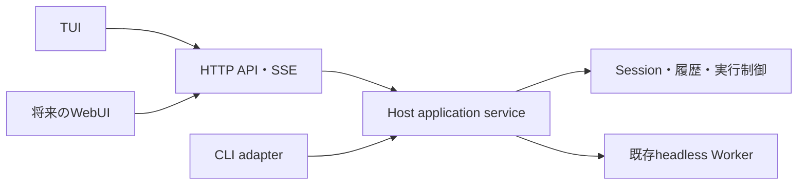
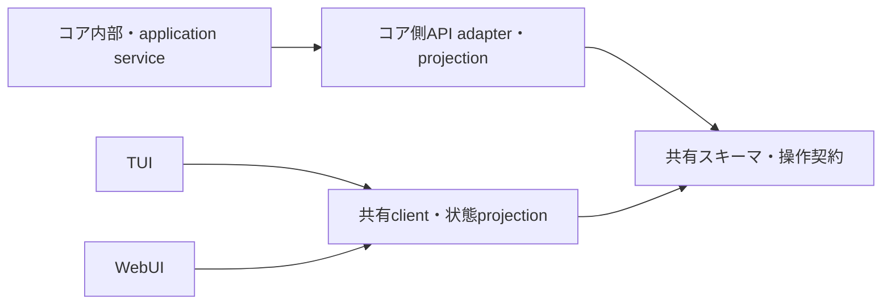

# S22 — 独立HTTPコアとTUI分離の設計検討

更新日: 2026-09-27

ステータス:
議論の整理と参照実装調査。2026-09-27に詳細設計とslice分割計画の作成が指示された。
現在の具体案は[詳細設計・段階実装計画](s22-detailed-design-and-slices.md)を参照する。
通常`henji`は明示TUI起動の省略形とし、未起動なら独立コアを自動起動する。
利用者からCLI形式の選択を委任され、core単独起動・TUI・将来WebUIをsubcommandで整理した。
サードパーティAPI、history／streamの具体案は[CLI・外部API利用設計](s22-cli-and-external-api.md)を参照する。
以下の起動UX・未決事項・slice例は詳細設計前の検討記録であり、最新提案はリンク先を正本とする。
実装着手・完了を意味しない。

## 目的と判断の状態

利用者はS22について、まずTUIを分離し、API経由でコアの状態を読み取る構成を希望している。
設計では将来のWebUI、CLIオプション、スラッシュコマンドとの関係、および他要件との衝突を整理する。
追加議論では「HTTP
APIで独立起動し、UIを閉じてもコアは動かせる」が希望する方向として示された。
この文書の作成と参照実装調査は指示済みである。

次の区別を維持する。

- 利用者の希望:
  APIによるTUI分離、将来のWebUIへの配慮、独立HTTPコアとUI終了後の継続。
- 現時点の設計提案:
  TUIとWebUIの通信をHTTP＋JSON／SSEへ統一する。専用RPCは必要になった時点で検討する。
- 未承認:
  詳細API、CLIの起動UX、Sessionの稼働単位、実装範囲、architecture・roadmapの意味変更。
- 未採用: WebUI本体、コア再起動後の途中task再開、mailbox、schedule、durable
  AgentInstance、ACP。

通常利用メモの「常駐化は未採用」は当初の候補記録であり、今回の希望を排除する条件ではない。
API分離と独立起動を採用する場合の変更案をここへ整理し、採用済みのarchitectureへ先回りして反映しない。

## 根拠と現行product経路

現行source確認: Henji commit `c4da8f7956d5152f739c868c38f6ca25f1903388`。
実行やprovider callを行わず、sourceと既存の要件文書を確認した。

正本への入口:

- [構想](../concepts/experience-driven-self-revision.md):
  productの目的、人間による採用境界。
- [architecture](../architecture/henji-host-agent-worker.md):
  Host／Worker／Surfaceと状態所有。
- [roadmap](../roadmap.md): F01、F05、F10、F12と未採用の追加機能。
- [S22と関連候補](../experience/normal-use-inbox.md): S4、A2、A21、E3、P10等。
- [参照実装調査](../research/s22-agent-client-server-comparison.md):
  OpenCode、Pi、DeepSeek Harness。

現行経路は次のとおりである。

1. `v0/agent/cli/henji_cli.ts`がTUI／run／history等を振り分ける。
2. `tui_cli.ts`がprovider宣言・既定selection・Definitionを解決し、`createWorkerSession()`を呼ぶ。
3. `worker_tui_session.ts`がSession handle、履歴、Worker、navigation、startup
   projectionを準備する。
4. `TuiPresentationAdapter`がcore eventをPresentation
   eventへ写し、型付きintentをdispatchする。
5. `TuiController`が入力・overlay・pending・follow-upの自動送信を管理し、rendererが端末へ描画する。
6. TUI終了時にcomposition
   rootがfactoryの`close()`を呼び、現在Host／Workerと資源を終了する。

`henji run`も同じWorker session
factoryを使う。`henji history`は別プロセスからread-onlyで履歴を読む。
この実行経路を土台にし、別のagent loopや履歴の正本を増やさない。

## 推奨する境界

Hostを独立して起動し、TUIをHTTPクライアントとして接続する。
Surfaceは引き続きHost側のinteraction
adapterという論理的な位置付けを持ち、物理processを分ける。
WorkerへTUI／WebUIの識別、キー、viewport、HTTPを持ち込まない。

| UIが所有するもの                                | コアが所有するもの                                 |
| ----------------------------------------------- | -------------------------------------------------- |
| 未送信draft、cursor、入力履歴、viewport、layout | Session、semantic履歴、本文state、実効構成         |
| キーとslash文字列の解釈、help、picker表示       | submit／steer受付、follow-up予約・自動実行、cancel |
| catalogの表示・検索、path候補の挿入             | catalogとworkspace path候補の生成・取得            |
| credentialの専用入力欄                          | credential保存と存在状態の取得                     |
| 接続先と表示対象Sessionの選択                   | Worker lifecycle、commit、process所有・清算        |

APIは読み取りだけでなく、操作とイベント購読も含める。UIはSession、navigation、storageのobjectを受け取らない。
共有clientはデータ取得・購読とその整合を担当し、端末rendererとWeb
rendererを別にする。 CLIの共通操作は同じapplication
serviceへ接続できる。全CLIを別プロセス通信へ変更することは未決である。

## スキーマ・コア・UIの整合

利用者補足（2026-09-27）:
通信の分離だけでなく、スキーマ、コア、UIの三者の構造と整合を重視する。
ここでは共有APIスキーマを軸とし、コアの保存schemaとUI-local
stateとの対応も扱う。
以下は設計の具体化案であり、詳細schemaや実装を承認済みとは扱わない。

### 役割と依存方向

スキーマはcommand、受付結果、状態read
model、eventについて、UIとコアが共有する意味とデータ表現を定義する。
コアは実行・状態遷移・保存の正本を所有し、schemaに従う値を境界から提供する。
UIはschemaに従うclient projectionを参照し、表示と人間の入力を担当する。
スキーマを独立した状態ownerや実行serviceにしない。

| 対象         | 正本・責務                                       | 他の対象との関係                                                       |
| ------------ | ------------------------------------------------ | ---------------------------------------------------------------------- |
| 共有スキーマ | 操作の入力・結果、状態・eventの意味とwire形状    | core runtimeやTUI／WebUIの実装をimportしない                           |
| コア         | Session・execution・実行制御・semantic履歴の正本 | application境界で共有schemaへ投影し、操作結果を確定する                |
| UI           | 表示・draft・cursor・viewport・overlay           | 共有contractとclientを使い、コア内部objectや保存schemaを直接参照しない |
| HTTP adapter | URL・method・status・JSON／SSEへの対応付け       | 共有schemaの意味を変えずに配送する                                     |

依存関係は次の形にする。コアdomainをAPIのDTOと同じ型へ全面的に置換することは要求しない。

この図の矢印は依存を表す。データの流れは、 「UI action → schemaに従うcommand →
コアの適用 → schemaに従う結果／event → client projection → UI」である。
状態の読み取りは「コア正本 → read model → client projection → UI」となる。
HTTP／SSEはこのデータを運ぶ。

### 保存schema・APIスキーマ・UI stateを混同しない

コア保存schemaは履歴・attribution・canonical
adoption等の保存契約であり、そのまま公開APIにしない。 APIのread
modelは、利用者が状態と実行を理解・操作するために必要な値をコアが生成する。 UI
stateはread
modelの表示用projectionに加え、draftやviewport、接続中・送信応答待ち等のローカル状態を持つ。

例えばfollow-upには、次の対応が必要になる。

1. UIがdraftを編集する段階では、コアのqueueは変わらない。
2. 送信中の表示はUI-localであり、予約受付済みとは表示しない。
3. コアが予約を受け付け、その結果とpending stateを共有schemaで提供する。
4. UIは受付結果を確認してdraftを消し、コアのpendingを表示する。
5. 自動実行開始・cancel・失敗によるpending変更も、コアの結果／state／eventへ反映する。
6. 再接続したUIはsnapshotから同じpendingと実行状態を復元する。

操作受付、実行開始、terminal outcome、canonical commitは異なる意味として表す。
コアの状態の意味・適用可能な操作をUI側で別に定義し直さない。
操作可否を公開する場合はコアの実際の適用条件から生成し、UIはその値を操作案内へ使う。
案内後に状態が変わった場合の受付判断もコアが確定する。
「UIが接続中／応答待ち」と「コアがbusy／queued／cancelling」は別の状態である。

### 共通定義とprojectionの整合

共有schemaの正本を一か所に定め、型・wire表現・必要なcodecをその定義に揃える。
コア用、HTTP用、TUI用、WebUI用に同じDTOの意味を手書きで複製しない。
OpenAPIを公開する場合も共有定義との対応を一か所で管理する。 生成基盤やschema
libraryの具体的な選定は未決であり、この構造のためだけに大型のcodegenを導入しない。

snapshotとeventは同じread modelを表現し、次の性質を満たす必要がある。

- 同じ観測点で、snapshotの値と、直前のsnapshotに以後のeventを適用したclient
  projectionが一致する。
- 操作の返却値とeventに同じ事実がある場合、相関方法を定めて二重適用しない。
- 最新本文／thinkingの置換と、semantic履歴への確定を区別し、同じ本文を二重に追加しない。
- Sessionの表示対象を変更しても、別executionの更新を新しい表示対象へ適用しない。
- TUIとWebUIは同じ共通stateを利用し、表示の違いだけで実行状態や結果の意味が変わらない。

確認は実装したproduct動作で行う。例えば、follow-up予約から自動実行への変化をliveで表示した結果と、
再接続後のsnapshot表示を照合する。仮想的な状態matrixの網羅を目標にしない。

### 現行contractからの見直し対象

`PresentationIntent`／`PresentationEvent`は土台にできるが、現行のまま共有APIスキーマにしない。
`dismiss_overlay`やprocessのexit
codeを持つ`exit`、`PresentationProjection.pending`のeditor情報など、
UI-localな意味とコアの実行意味が混在する部分を整理する。
`AdapterSessionPort`の同期snapshotやlive object返却も、HTTP
contractへ直接公開しない。

コア操作、公開read model、client projection、TUI-local
stateの対応表を詳細設計で作り、
既存機能がどこへ移るかを明示する。共有スキーマへの切替を理由に保存schemaのmigrationや互換readを追加しない。

## API契約と通信方式

APIの操作名、入力、受付結果、状態、イベント、実行・切断の意味をapplication
contractとして定める。 URL、HTTP method、status、JSON表現、SSE framingはHTTP
adapterで対応付ける。 RPCとHTTPは異なる層であり、JSON-RPC over
HTTPも可能である。
[JSON-RPC仕様](https://www.jsonrpc.org/specification)も通信方式から独立した形式として定義している。

今回の提案はHTTP＋JSONによる操作／取得と、[SSE](https://html.spec.whatwg.org/multipage/server-sent-events.html)
によるイベント配信である。TUIも同じHTTP
APIを使う。通信adapterを交換可能にするためだけに、初回から
複数protocol、汎用service discovery、API generator、plugin
frameworkを追加しない。

必要な操作群:

- 状態: Session
  position、実行状態、selection、checkpoint、pending、credential存在状態。
- 参照: Session一覧、履歴、provider／model／effort
  catalog、登録profile、path補完候補。
- 実行: ordinary submit、steering、follow-up予約、cancel。
- Session: 作成・開始・再開・rename、recall準備／clear、既存compaction操作。
- 設定: selection変更、credential専用登録。
- 購読: 本文、thinking、tool activity、実行結果、状態・binding変更。

URLとDTO名は未確定。stateful operationには対象Sessionまたはexecutionを明示する。
全UIに共有される「現在Session」を、利用者の表示対象と同じ意味でコアに一つだけ置かない。

受付と完了は別に表す。submitの受付後はexecutionを識別して状態・結果を参照でき、turn完了はイベント／結果取得で
受け取る。cancel・steerはturn完了を待たず処理できる。通信の直列化で長いsubmitがcancelを塞がない構成にする。
UIは実際の受付結果を待ってdraftを消す。

## 履歴・live state・再接続

初回接続と再接続では、対象Sessionの履歴、現在状態、途中本文／thinkingの最新値を取得し、以後の更新へ接続する。
snapshot取得中に発生したイベントを欠落・重複させない切替点を契約へ含める。
Session／execution identity、購読の順序、本文／thinkingの置換単位を区別する。

候補は「購読開始時にsnapshotと以後のイベントを順序付きで返す」構成である。
別のGETとSSEを使う場合も、snapshotと購読の間の更新を接続できる仕組みが必要である。
SSE再接続だけで過去イベントの再送が成立するとは扱わない。最新snapshotからの復元でも要件を満たせるようにする。
受付応答が失われた場合の照合方法は未決であり、taskを無条件に自動再送しない。

既存semantic履歴とrequest単位の最新本文stateを正本にする。
APIのための永続イベントlog、raw
request／response、SSE断片、parser全文の常設保存は追加しない。
履歴参照だけの操作で新たなWorker generationやprovider callを開始しない。
TUIの現行再開表示と`history --view session|canonical|detail`の違いは維持し、API化だけで表示内容を変更しない。

## 独立コアのlifecycle

| 操作・出来事                         | 提案する意味                                                 |
| ------------------------------------ | ------------------------------------------------------------ |
| TUIの`/exit`、通常終了、UI接続の切断 | 接続・購読・UI資源を終了。受付済み実行はコアで継続           |
| UIの未送信draft                      | UI-local。コアへ未受付のtextは実行予約にしない               |
| 受付済みsteering／follow-up          | コア所有。UIが閉じても既存の受付・実行意味に従う             |
| 明示cancel                           | 対象executionを停止・清算する                                |
| コアshutdown／終了signal             | Workerと所有processを清算して終了する                        |
| 再接続                               | Sessionを選び、履歴・現在状態・live更新を復元する            |
| コア自体の再起動                     | 保存履歴から再開可能。途中taskの自動継続は今回の前提にしない |

HTTPのrequest／購読のAbortSignalと、受付済みexecutionのcancelを分ける。
UI出力失敗がコアのturn失敗へ直接伝わる現行sink構造も見直す。
明示cancelによるfollow-upの扱いは現行動作を基準に定め、UI切断を同じ出来事へ写さない。

独立コアをforegroundの`serve`で起動することと、OSログアウト後も存続させるservice運用は区別する。
自動daemon化・systemd登録・自動起動の採否は未決。UIと別のprocess
lifetimeを持つことは必要である。

## CLIオプションとの関係

起動UXの例は`henji serve`と`henji tui --connect <url>`、または`henji attach <url>`である。
名前、引数なし`henji`の動作、未起動時の自動起動は未確定。
接続先serverの起動設定と、Sessionを開始する条件と、UI表示条件を区別する。

| 現行入口・option                                       | 現行意味と設計上の扱い                                                                      |
| ------------------------------------------------------ | ------------------------------------------------------------------------------------------- |
| `--agent`／`--definition-revision`                     | Definition選択。コアが解決し、Session開始／継続条件へ渡す                                   |
| `--continue`／`--session`                              | 接続先のSessionを選択・再開。既存selectionとattributionを維持                               |
| `--no-session`                                         | canonical Sessionを永続保存しないモード。全てのexecution evidenceを無保存にする意味ではない |
| `--root-provider`                                      | 現在TUIのみ。新規Sessionの初期selectionへ渡す                                               |
| `--max-steps`                                          | rootの上書き。Definitionが既定値を所有する関係を維持                                        |
| `--provider-timeout-ms`                                | 現行invocation単位でSession切替をまたぐ。独立Hostでは適用単位を明示する必要がある           |
| `henji run --task`／stdin                              | one-shot入力。保存・終了・exit codeと通常TUIの違いを維持                                    |
| `henji run --json`／`--stream`                         | CLIの出力projection。SSEや内部eventをそのままstdout contractにしない                        |
| `history`／`sessions`／`module`／`tool`／`diagnostics` | 現行機能を維持。接続先APIとlocal storeのどちらを使うかは対象ごとに決める                    |

selectionの現行優先順位:

- 再開Session:
  保存済み`activeModel`を使う。新規向けの初期selectionで上書きしない。
- 新規Session: 明示`--root-provider` > 保存済みdefault selection >
  組み込みdefault。
- `/new`: 現在selectionを引き継ぐ。
- `/provider`／`/model`／`/effort`:
  idleで変更し、次turnへ適用。Session保存と新規Session用default更新がある。

独立Hostへの接続時に、起動専用optionを既に動くHost全体へ暗黙適用しない。
`maxSteps`、provider timeout、Definition、selectionのscopeは同じではない。
新しい`runtime.json`の採用や、`henji run`への`--root-provider`追加は今回の分離から自動的には導かない。

## スラッシュコマンドとの関係

| command                          | UIの責務                   | コアの操作                           |
| -------------------------------- | -------------------------- | ------------------------------------ |
| `/help`                          | help表示                   | 原則なし                             |
| `/sessions`                      | 一覧・picker・表示対象選択 | Session一覧・必要な継続開始          |
| `/new`                           | 新Sessionへの表示切替      | Session作成・開始                    |
| `/rename`                        | title入力・結果表示        | Session rename                       |
| `/provider`／`/model`／`/effort` | catalog取得・picker        | selection変更・保存                  |
| `/recall`                        | ID入力・次task用準備の表示 | evidenceの明示参照準備／clear        |
| `/login`                         | profile選択・専用伏字入力  | credential登録・存在状態更新         |
| `/exit`                          | UI終了・切断               | コアshutdownやexecution cancelとは別 |

slash文字列はUI側で型付き操作へ写す。WebUIのbuttonも同じ操作を呼ぶ。
help、picker、editor等のUI操作を全てAgent toolへ公開することは意味しない。
S4の`/rebuild`、A2のAgentからのHost操作・次turn
model変更、P3の`/compact`は未採用のままである。 既存の内部compaction
intentがあることと、公開slash commandがあることも区別する。

## 具体的な懸念・他要件との関係

| 項目                      | sourceから確認できる問題・調整                                                                                   |
| ------------------------- | ---------------------------------------------------------------------------------------------------------------- |
| 非同期steering            | `controller.ts`はPromiseならaccepted扱いにする。HTTP受付結果を待つ形へ変更が必要                                 |
| follow-up                 | TUIの`PendingInputCore`とControllerが予約・自動送信を所有。adapterのintentは受付結果だけ返す。コアへ実制御を移す |
| direct read               | model／credential／context／positionの同期snapshot参照を、client projectionとAPI取得へ置換                       |
| catalog・credential・path | TUIからprovider module・保存・filesystemを直接使う経路をコアへ移す                                               |
| Session表示切替           | 現行navigationは旧Hostをcloseする。独立コアでは表示対象変更とgeneration終了を分ける必要がある                    |
| 複数UI                    | connectionごとの表示対象を持つ。複数writer、複数Sessionの同時実行の範囲は未決                                    |
| request／UIの終了         | 現行composition rootの`close()`とsink例外伝播を、コアのshutdown／実行停止と別にする                              |
| Increment 133             | processはコアHostが所有。UI切断で清算せず、generation終了や明示cancel等の既存境界で清算                          |
| standalone binary         | 同じbinaryにserver／client入口を持てる。repository checkout・PATH上Denoへの新たな依存を増やさない                |
| F05・134                  | semantic authorityと本文stateを再利用。canonicalとnoncanonical、human viewとmodel projectionを混同しない         |
| S17〜S20                  | 描画・文字幅・巨大画面は別候補。API化のために同時採用しない                                                      |
| E3・F06                   | Host設定とDefinitionのmaxSteps authorityを重複させない                                                           |
| P10                       | HTTP操作共有はACP採用を意味しない                                                                                |

credential値とAuthorizationはsnapshot・event・history・diagnosticへ記録しない。
`/login`は専用登録requestでのみ値を扱い、通常command/eventの記録へ混ぜない。
接続先の想定（同一machine、VM間、SSH転送等）は未確認であり、具体化が必要。
今回の調査から一般的hardening、permission matrix、汎用入力制限を採用しない。

## 難易度・作業量と進め方の案

難易度は中〜高、作業量は多め。独立server、TUIの非同期client化、実行所有、再接続をまたぐ変更である。
特に入力受付・draft消去、follow-up、UI終了とcancelの分離、snapshot／live切替がcorrectnessの中心となる。
既存Worker、Session保存、Host coordinator、Presentation contractを再利用できる。
正確な工数はSession稼働scopeとCLI起動UXを確定してから見積もる。

一つのincrementを次の実装sliceへ分ける案である。まだ承認済み計画ではない。

1. 共通操作・状態契約を定め、TUI-owned実行制御をHost serviceへ移す。
2. 独立HTTP入口とclient、状態取得、操作、SSE購読を実装する。
3. TUIをclientへ置換し、CLI／slash入口を接続する。旧direct経路を同じ変更で整理する。
4. UI切断後の継続と再接続を実経路で確認する。

受入候補は「独立コアへTUIで接続し、送信・steering・follow-up・cancel・Session操作・各picker・loginを使え、
UI終了後に実行が続き、再接続で結果と途中状態を読める」である。 source／compiled
binaryのtmux production TUI、隔離XDGで確認する。
自動確認はこのproduct動作に対応するfocused test等を使い、途中でfull
gateを繰り返さない。
実provider確認は対象・回数・保存先を提示して明示承認を得る。

## 次に決めることと正本変更案

1. 共有スキーマの正本、コアのread model、client projectionとUI-local
   stateの対応。
2. 起動UX: explicit `serve`／`attach`と、引数なし`henji`の扱い。
3. HostのworkspaceとSession稼働scope、表示切替時の旧Sessionの扱い。
4. invocation設定を独立Host／Session／executionへどう対応付けるか。
5. 受付応答とexecution identity、snapshot／SSE切替と再接続の詳細。
6. API接続先の実利用環境と、初回incrementの実装・受入範囲。

採用時に必要なproduct正本変更案:

- architecture: Host
  coreとSurfaceのprocess／API境界、独立lifecycle、受付済み入力のHost所有、 UI
  detachとexecution cancel／generation closeの区別を追加する。
- roadmap:
  F01／F10に独立HostへのTUI接続・切断後の継続・再接続を位置付け、実装状態を管理する。
- 構想: 現段階では変更の必要を確認していない。

上記architecture・roadmap変更は、対象・理由・意味変更を提示して別途明示承認を得る。
設計採用後は個別incrementを正本にし、通常利用メモのS22候補を移す。
