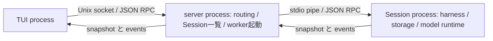

# A28三段階案のレビューとPi・Cloudflare Agents比較

調査日:
2026-10-02。三段階案は合意済みの検討方針であり、実装の開始やarchitecture正本の変更を意味しない。

利用者の懸念は、Workerによる機能分離が複雑化を招き、別の機能問題や性能悪化を起こさないか、である。
通常レビューと批判的レビューを独立に依頼し、親agentがPiとCloudflare Agentsの固定sourceを調査した。
両レビューはsourceと既存の隔離診断をread-onlyで確認し、provider call、full
gate、production変更を行っていない。
比較調査もstatic確認であり、参照productの実行や性能比較は行っていない。

## Piの確認範囲

新しい調査には `_refs/README.md` のPi snapshot `b35af04f465d60c2f15d124ed074476b8986deb4` を使った。
以前のS22・表示比較文書が記録した `08dc60bc…` と混同しない。
upstreamの固定commitのREADMEとsourceもオンラインで確認した。 参照productの起動、provider
call、性能測定、snapshot更新は行っていない。

### 通常経路と実験経路を分ける

Piの通常CLIは一つのAgentSessionRuntimeを作り、同じprocessでinteractive、print、RPC modeを選ぶ。
CLIを個別Workerへ配置した直接例ではない。 根拠:
[main.ts](https://github.com/earendil-works/pi/blob/b35af04f465d60c2f15d124ed074476b8986deb4/packages/coding-agent/src/main.ts)、
[print-mode.ts](https://github.com/earendil-works/pi/blob/b35af04f465d60c2f15d124ed074476b8986deb4/packages/coding-agent/src/modes/print-mode.ts)。

近いのは実験版の `experimental/mini` と `experimental/services` である。 full
experimentalのserver/clientはsource-onlyで、npm packageとstandalone binaryに含まれない。 根拠:
[services README](https://github.com/earendil-works/pi/blob/b35af04f465d60c2f15d124ed074476b8986deb4/packages/coding-agent/src/experimental/services/README.md)。

### miniの実際の配置

Session単位のworkerは `node:child_process.spawn` で起動するprocessであり、
Henjiが検討する同process内のDeno Workerと同じ実行単位ではない。 serverはagent
stateを所有せず操作を転送する。会話組み立て専用Workerはない。 根拠:
[server/run.ts](https://github.com/earendil-works/pi/blob/b35af04f465d60c2f15d124ed074476b8986deb4/packages/coding-agent/src/experimental/mini/server/run.ts)、
[worker/run.ts](https://github.com/earendil-works/pi/blob/b35af04f465d60c2f15d124ed074476b8986deb4/packages/coding-agent/src/experimental/mini/worker/run.ts)。

clientは `lane.watch(presentationId)` のsnapshotを保持した後、`lane.start(subscriptionId)` を呼ぶ。
その間のeventsはharness側のwatchが保持し、startで配信する。
初回と再取得は同じresubscribe経路を使い、古いsubscription IDのeventsは新stateへ適用しない。
通常のmessage/tool/entry更新は共有の `reduceLaneSnapshot` で増分適用し、navigation等のrebase時だけ
snapshotを取り直す。viewはstable entry IDで既存行を保持し、生成中messageを更新する。 根拠:
[worker/lane-service.ts](https://github.com/earendil-works/pi/blob/b35af04f465d60c2f15d124ed074476b8986deb4/packages/coding-agent/src/experimental/mini/worker/lane-service.ts)、
[tui/session.ts](https://github.com/earendil-works/pi/blob/b35af04f465d60c2f15d124ed074476b8986deb4/packages/coding-agent/src/experimental/mini/tui/session.ts)、
[reducer.ts](https://github.com/earendil-works/pi/blob/b35af04f465d60c2f15d124ed074476b8986deb4/packages/agent/src/harness/runtime/reducer.ts)、
[tui/view.ts](https://github.com/earendil-works/pi/blob/b35af04f465d60c2f15d124ed074476b8986deb4/packages/coding-agent/src/experimental/mini/tui/view.ts)。

この配置は責務分離の方向の参考になるが、snapshot/streamを対応させる処理は消えていない。
harnessのwatch実装が引き受けており、独立DB readerを別Workerへ追加するHenjiがそのまま利用できる
保証ではない。固定sourceではLaneのreadとwatch登録、snapshot capture、buffer drainに分かれる。 根拠:
[lane.ts](https://github.com/earendil-works/pi/blob/b35af04f465d60c2f15d124ed074476b8986deb4/packages/agent/src/harness/runtime/lane.ts)、
[events.ts](https://github.com/earendil-works/pi/blob/b35af04f465d60c2f15d124ed074476b8986deb4/packages/agent/src/harness/events.ts)。

### full experimentalはprovider側の増分stateを複製する

Transcript providerはwatchで初期snapshotを取り、イベントごとに同じreducerでtracked stateを変更し、
Chordがclientへ複製する。Coreから会話導出をすべてSurfaceへ移した実装ではない。
操作はAgentController、表示stateはTranscript、UI-localはPresentationUI/SlashCommandsという分離が近い。
ただしChordのservice catalogue、facet、replicated state、plugin reloadは、Henjiで今回必要と確認した
機能ではない。責務分離と共有reducerの仕組みを参照し、基盤全体の導入を対策の前提にしない。 根拠:
[transcript-provider.ts](https://github.com/earendil-works/pi/blob/b35af04f465d60c2f15d124ed074476b8986deb4/packages/coding-agent/src/experimental/services/transcript-provider.ts)、
[agent-controller-provider.ts](https://github.com/earendil-works/pi/blob/b35af04f465d60c2f15d124ed074476b8986deb4/packages/coding-agent/src/experimental/services/agent-controller-provider.ts)。

### そのまま採用しない差分

- miniは最後のpresentationが離れるとSession workerを停止する。Henjiのdetach後も実行を維持する
  要件と違うため、このlifecycleを採用しない。
- mini READMEのN² event配信というshortcut説明は、固定sourceの宛先付きroutingと食い違う。
  workerはwatchごとのpresentation IDを `emitTo` へ渡し、serverは該当client一件へ転送する。
  READMEの記述だけを根拠に現行sourceのN²性能問題と判断しない。
- stable PiのCLI、mini、full
  experimentalは異なる経路であり、一つの完成した構成として足し合わせない。
- PiのSession実行・保存とHenjiのcanonical採用/process cleanupは同じcontractではない。 client
  reducerで終了を推測せず、Henjiのownerが確定する値を維持する。

Piは今回確認した範囲で、責務分離・操作と観測の共通境界・増分表示の有力な参照である。
API/CLI/組み立てを個別Workerへ配置する三段階案の直接的な実証や、Henjiの性能保証とは評価しない。

## OpenCodeとの限定比較

Piが全参照productの中で一番近いという順位付けは行わない。既存の比較対象OpenCodeについて、
同じ固定snapshotの通常TUI入口とWorker入口だけを追加確認した。
`e9f8a210b9e2b1e13d375b84906069886eb3b767` の通常TUIはWorkerを起動し、
HTTP相当のfetchとeventsをRPC中継する経路と、Worker内でHTTP serverをlistenする経路を選べる。
APIをWorkerに置くphysical配置の参考はOpenCodeにもある。ただし独立した実行制御Coreを残し、
APIだけを別Workerへ移したHenji案と同じ配置ではない。 根拠:
[tui.ts](https://github.com/anomalyco/opencode/blob/e9f8a210b9e2b1e13d375b84906069886eb3b767/packages/opencode/src/cli/cmd/tui.ts)、
[worker.ts](https://github.com/anomalyco/opencode/blob/e9f8a210b9e2b1e13d375b84906069886eb3b767/packages/opencode/src/cli/tui/worker.ts)。

## Cloudflare Agentsの確認

会話表示・cancel・再接続に対応する `AIChatAgent` と `agents/chat` を中心に確認した。 固定snapshotは
`040458edb8f2c87a25e5ac446709054a5f553e14`。 既存snapshotに含まれないAgent本体・AIChatAgent・React
hookとtransportは、同じcommitから 一時directoryへ取得した。参照snapshotの更新は行っていない。
公式文書は調査時点の説明として参照し、固定sourceと同じ版だとは扱わない。 Thinkのdurable
execution、subagent、platform全体の設計比較は今回の確認範囲に含めていない。

### 物理配置より、共有導出と配信境界の参照になる

公式のchat経路は、server側のAIChatAgentとclient側のuseAgentChatで構成され、SQLiteの会話保存と
WebSocketによる更新・再開を持つ。
固定sourceのAIChatAgentはAgentを継承し、そのAgentはDurableObjectを継承する。 同じAgent
objectにHTTP・WebSocket handlerと会話state・保存・stream管理がある。
この経路は、実行制御Coreを残してAPI・CLI・組み立てを別Deno Workerへ配置するHenji案の直接例ではない。
CloudflareのWorker／Durable Objectという実行基盤を、今回のDeno Worker境界と同一視しない。 根拠:
[公式Chat agents](https://developers.cloudflare.com/agents/communication-channels/chat/chat-agents/)、
[Agent本体](https://github.com/cloudflare/agents/blob/040458edb8f2c87a25e5ac446709054a5f553e14/packages/agents/src/index.ts)、
[AIChatAgent](https://github.com/cloudflare/agents/blob/040458edb8f2c87a25e5ac446709054a5f553e14/packages/ai-chat/src/index.ts)。

AIChatAgentは `applyChunkToParts` で途中messageを増分更新する。 clientのuseAgentChatは
`broadcast-state` のtransitionを使い、そこではStreamAccumulatorが 同じ `applyChunkToParts`
を呼んでmessageを組み立てる。
表示protocolのchunkを意味あるpartsへ変換するhelperを共有し、保存・配信等の副作用をcallerへ返す構成は、
段階3の共通会話導出moduleの参考になる。共有moduleにしてもserver/client各々の処理量は残る。
Henjiのcanonical採用・execution outcome・semantic
identityをこのUIMessage形式へ置き換える案ではない。 根拠:
[StreamAccumulator](https://github.com/cloudflare/agents/blob/040458edb8f2c87a25e5ac446709054a5f553e14/packages/agents/src/chat/stream-accumulator.ts)、
[broadcast-state](https://github.com/cloudflare/agents/blob/040458edb8f2c87a25e5ac446709054a5f553e14/packages/agents/src/chat/broadcast-state.ts)、
[React hook](https://github.com/cloudflare/agents/blob/040458edb8f2c87a25e5ac446709054a5f553e14/packages/agents/src/chat/react.tsx)。

### cancelと再接続には明示した経路がある

cancel handlerはrequest IDからAbortRegistryのcontrollerをabortし、scheduled
recoveryをキャンセルする。
会話全履歴の組み立てを対象照合の前提にしない点は、段階1の軽いcancel経路の参考になる。
ただし同じhandlerの実行機会が必要であり、この仕組みだけで重い同期処理から隔離できるという証拠ではない。
根拠:
[AbortRegistry](https://github.com/cloudflare/agents/blob/040458edb8f2c87a25e5ac446709054a5f553e14/packages/agents/src/chat/abort-registry.ts)、
[AIChatAgentのcancel handler](https://github.com/cloudflare/agents/blob/040458edb8f2c87a25e5ac446709054a5f553e14/packages/ai-chat/src/index.ts#L1617)。

resume通知を受けた接続はACKまでlive broadcast対象から外され、replayとの境界を管理する。
client側のhandler登録後にresume requestを送る経路もある。
つまり初回・再接続の整合性を「Workerへ分けたから成立する」とは扱わず、protocolに明示している。 根拠:
[ResumeHandshake](https://github.com/cloudflare/agents/blob/040458edb8f2c87a25e5ac446709054a5f553e14/packages/agents/src/chat/resume-handshake.ts)。

CloudflareのResumableStreamは配信用chunkをSQLiteのdurable logへ保存して再生する。
これはproviderのraw SSE全文保存とは異なるが、Henjiのsemantic履歴を正本とする現在方針に
追加のdurable配信logを導入する判断でもある。単なるWorker分離の付随実装として持ち込まない。
Henjiでは既存semantic・途中本文state・公開snapshotで必要な再接続を成立させる範囲を先に確認する。
根拠:
[ResumableStream](https://github.com/cloudflare/agents/blob/040458edb8f2c87a25e5ac446709054a5f553e14/packages/agents/src/chat/resumable-stream.ts)。

## 通常レビューの結果と親agentの採否

判定: 三段階の方向は妥当で、段階1の詳細計画へ進める。 以下はcurrent
sourceに基づく計画上の必要事項であり、未実装案の新規bugとして登録しない。

「古い結果」の扱いは、会話候補とCoreが所有する現在状態の役割を実装で維持する事項である。
キャンセル済み表示が実行中へ戻る現象は観測・再現しておらず、新規bugや追加対策として扱わない。
未観測のネットワーク遅延をこの検討の根拠にしない。

1. **読取境界と公開revisionは段階1で必要。** 現行projectionは複数queryと途中本文stateを読み、
   `readSessionHistory`のtransactionだけではprojection全体を同じ時点に固定しない。
   別readerへ移した際のDB snapshot・未保存のlive
   stateとの対応、Session/slot/読取世代、古い結果の扱いを決める。
   Coreの最新runtime・pending・selection・軽いexecution
   metadataを合成し、公開revisionの確定ownerを一つにする。
   具体方式は未決だが、必要性を採用する。新fact feedの設計とは分け、段階3へ先送りしない。
2. **cancelの全経路を軽くする。** 対象照合だけでなく、操作可否、Hostのruntime通知とjournal
   append通知、 command返答も同期projectionへ戻る。これらから会話再構築を外す。
   journal保存と`tasks.observe`の個別処理は維持し、表示の再構築要求を合流させる。採用する。
3. **初回・再接続の取得と購読を対応させる。**
   Worker読取中の更新を保持してbootstrap後に順序通り渡す、
   またはCoreの確定公開snapshotと購読を一つの処理で取得する等の境界が必要。旧wireのままで対応できる。
   保存Sessionの初回接続・再接続・slot切替は段階1の確認範囲へ含める。採用する。
4. **段階2はdata-onlyの操作・観測境界を具体化する。** 同期method、callback、sink、unsubscribe関数と
   `CoreServiceError instanceof`はそのままWorkerを渡れない。operation返答・error
   code・subscription・終了を
   dataへ変換する。headlessはApplicationService/CoreServiceを通らないため、両ownerへの接続範囲を決める。
   CLIのHTTP client化・常駐Core必須化は必要ない。段階2の計画事項として採用する。
5. **終了とstream末尾を保持する。** CLIは実行settlement、Host cleanup、stdout/stderr
   drain後に完了する。 結果受信だけでCLI Workerをterminateしない。APIのpending
   handler・SSE終了とCore close、listen成功後の endpoint公開、TUI
   detach後の実行継続を維持する。段階2の計画事項として採用する。

根拠source: `v0/agent/host/core_service.ts`、`application_service.ts`、`task_service.ts`、
`v0/agent/history/sqlite_history_v7_production_store.ts`、`v0/agent/worker/worker_host_coordinator.ts`、
`worker_headless_runner.ts`、`v0/agent/http/server.ts`、`v0/agent/cli/runtime_cli.ts`、`v0/api/reducer.ts`。
軽い操作状態はtask stateだけではlifecycle/outcome/adoptionを満たさず、execution
metadataも必要である。

## 批判的レビューの結果と親agentの採否

判定:
三段階を覆す強い反対根拠はない。**段階1は観測した受付停止への対策、段階2は主に責務配置の選択**。
段階2に進む利用者の目的を保持し、未測定の性能効果を理由に必要性を誇張しない。

利用者が明示した段階2の主目的は、開発agentによる責務の混在を防ぐことである。
module上の分離だけでAPI・CLIの処理がCoreへ入り込む問題に対し、Worker境界と明示した
操作・観測interfaceで担当を固定する。性能改善の有無を段階2の採否条件にしない。
RPCや起動終了の追加負担は、その目的を成立させる実装を簡潔にする観点で評価する。

- 固定履歴・事前起動Workerの実験では、受付側タイマー最大gapの中央値が約290ms→6.8msに改善した。
  一方、結果受信までの中央値は同一loop約280ms、Worker約295msで、処理完了の高速化を示していない。
  Workerは受付側へ実行機会を残す。通知合流・読取共有・増分導出が総処理量を減らす。区別を採用する。
- 段階2ではRPCの要求対応、購読管理、返答と観測の順序、起動・終了、追加cloneが増える。
  現行CLIは全Session projectionを使わず、非同期writerで出力するので、A28と同じ停止原因を持つとは
  判断しない。Worker配置には責務分離の利益があるが、追加性能効果は未測定。採用する。
- 単純な「組み立てWorker→Core→API Worker」では大きなsnapshotが二境界を通る。
  「組み立てWorker→API」＋Coreの軽い確定stateという経路は中継cloneとCoreのdiffを減らし得るが、
  二経路の合成・公開revision・command返答cursorを合わせる処理が増える。段階2/3の比較候補に留める。
  未測定のclone負担から必須にしない。semantic保存・操作・採用のownerはCoreに維持する。
- CoreにはJSON比較によるdiff・購読時clone、HTTPにはSSEの同期JSON化・encodeが残る。
  診断の全文JSON化はタイマー停止後であり、production SSEの負荷を測定したものではない。 API
  Worker化でCoreの負荷を外しても、API内のHTTP受付とJSON化は同じloopにある。
  段階1/2の実経路確認で残留負荷を評価する。現時点で性能悪化は断定しない。
- APIとCLIは起動modeに応じて必要なadapterだけを起動できる。 HTTP Coreへ未使用CLI
  Workerを常駐させる必要はない。具体配置を決める際の簡略化候補として採用する。
- 段階1の通知合流・読取共有・軽い状態・cancel軽量化・pure導出は再利用可能。
  組み立てWorker専用RPC、Coreの全文cache/diff、旧snapshotのbootstrapは段階3で変更対象になり得る。
  段階1で完全な増分reducerを先に作り切ることは要求しない。段階2のtransport変更と段階3の意味処理を区別する。

根拠source: `v0/agent/host/core_service.ts`、`v0/agent/cli/runtime_cli.ts`、`run_events.ts`、
`v0/api/reducer.ts`、`v0/agent/http/server.ts`、
`.tools/e71f582a-stall/projection_execution_comparison_probe.ts` と同directoryの比較結果。
実験詳細と原観測は[継続検討](core-responsiveness-and-surface-conversation-review-2026-10-01.md)を参照する。

## 段階2のコピー負担の事前診断

利用者は段階2で性能向上よりも劣化を懸念し、追加コピーを事前に確認する必要を指摘した。
段階2の責務分離という目的は維持し、切り替え前に追加負担を確認する。

### 現行経路と増える境界

現行Coreは初回読取・購読でsnapshotをcloneするが、通常のSSE更新は
`diffSessionSnapshots`で作った変更frameを共有し、HTTP側でJSON化・encodeする。
段階1の組み立てWorkerからCoreへの配送に加え、段階2の単純中継ではCoreからAPI Workerへの
配送が増える。全snapshotは初回等に必要で、毎更新で全履歴を配送する必要はない。
thinking更新は現在のwireが累積textのupsertなので、その変更項目の本文全体を含む。 新しい差分text
protocolの導入をこの診断から要求しない。

### 実測範囲と結果

既存の隔離保存履歴 `e71f582a` から現行projectionのsnapshotを取得し、同じsaved executionの
450件のthinking eventを現在の `thinking.upsert` 形式へ配置した。
初回snapshotと最長thinkingの一件更新は、各modeでwarmup後に50回を交互に測定した。
初回用と一件更新用のframeは現行contractとdiff関数から作った診断用frameであり、 production
SSEで取得したframeの記録ではない。

比較経路は、事前起動済みの送信Worker→Core→SSE形式のJSON化・encodeと、 送信Worker→Core→API
Worker→同じJSON化・encode→小さい完了返答である。
測定区間にprojection・diff・HTTP/socket・UI描画・Worker起動は含まない。
`postMessage`の同期配送準備時間はCore側で別計測した。
配送・受信・API側JSON化・完了返答を含むため、増分時間をstructured clone単体の時間とは呼ばない。

| 対象                 | encode後サイズ | Coreでencode: 中央値 / p95 | API Workerでencode: 中央値 / p95 | 中央値の差 |
| -------------------- | -------------- | -------------------------- | -------------------------------- | ---------- |
| 初回snapshot         | 409,762 bytes  | 1.792 / 2.596ms            | 2.523 / 3.230ms                  | +0.731ms   |
| 最長thinking一件更新 | 37,842 bytes   | 0.188 / 0.268ms            | 0.252 / 0.382ms                  | +0.064ms   |

Core側の追加 `postMessage` 同期時間はsnapshotで中央値0.184ms・p95 0.359ms、
thinking一件更新で中央値0.010ms・p95 0.013msだった。 保存済み450更新、計8,772,720 encoded
bytesを一件ずつ続けて配送すると、全区間は45.493ms→62.983ms、
差17.490msだった。このsequence比較は各mode一回で、実際のstreaming間隔を再現していない。 provider
call、稼働Coreへの操作、production source変更、参照snapshot更新は行っていない。

このpayloadと隔離診断では追加配送による大きな劣化を示していない。 HTTP/API
Workerの全実装やproduction操作の性能を保証する測定ではない。 また、以前の別Worker
projection実験の約280ms対約295msという差からコピー負担だけを
推定しない。その比較にはprojection自体の変動も含まれる。

実行:
`HOME=/home/agent deno run --no-prompt --cached-only --allow-read --allow-write=.tools/e71f582a-stall --config deno.v0.json .tools/e71f582a-stall/api_copy_probe.ts`。
Deno 2.9.7、既存の隔離history readerはread-only。 local artifact:
[probe](../../.tools/e71f582a-stall/api_copy_probe.ts)、
[配送・encode Worker](../../.tools/e71f582a-stall/api_copy_probe_worker.ts)、
[計測結果](../../.tools/e71f582a-stall/api-copy-probe-results.json)。

### 切り替え前に必要な比較

段階1の安定候補をbaselineにして、同じ保存履歴・同じ更新を使ったAPI Workerの小さい比較実装で
初回表示、SSE更新、health／操作受付、Worker起動時間を測る。
CLIは現行の独立headlessを基準に、Worker化後も`--stream`の表示と最終drainまでを比較する。
これは現在の利用経路の確認であり、仮想の通信遅延、未観測の接続数、巨大payloadを追加した stress
matrixを要求するものではない。稼働Core・実providerはこの診断に使っていない。
API/CLIの比較実装方式と個別incrementの詳細計画は未決で、今回の診断はproduction変更の開始を意味しない。

## 継続議論の保存: 元データの所在・中継・表示用schema

利用者の就寝前の保存指示により、再開時に以下の論点を引き継ぐ。
三段階と条件は合意済みだが、下記のschema・直接配送・具体interfaceは検討候補で、採用決定ではない。

### 元データをCoreで読み出してWorkerへ送る必要はない

現行projectionはCore側のqueryでSQLiteのSession履歴・execution events・semantic occurrences・
assistant text states等を読み、Coreメモリ上のtranscriptとruntime等も参照する。
段階1では、組み立てWorkerが保存済みデータをSQLiteから直接読み出す案とする。
Coreで全履歴を読み、解析後の巨大objectをWorkerへ渡す方式は、Core側の負荷を残す。
SQLiteを別Workerで読むこと自体を禁止する理由は確認していない。
`persistence: none`では保存履歴を使えず、メモリ上の会話を渡す範囲・頻度は未決である。 根拠:
`v0/agent/worker/worker_tui_session.ts` のqueryと `v0/agent/host/api_projection.ts` の
`projectApplicationSession`。

### Coreの全文中継も比較対象にする

Worker間配送は、受信側のJavaScript objectを再構成するstructured cloneを伴う。
段階2の単純中継は「組み立てWorker→Core→API Worker」で、追加境界が一つ増える。
Coreの追加postMessage同期時間は今回の約410KB snapshotで中央値約0.184msだった。
重い履歴読取・組み立ての隔離効果を否定する数値ではないが、Coreでの全文cache・diff・中継の仕事は残る。
利用者は、Coreがコピーを担うなら処理負担が残る点を指摘した。 会話データを組み立てWorkerからAPI
Workerへ直接送り、Coreは実行状態と操作結果を提供する配置も
比較候補にする。会話組み立てWorkerは段階2でも維持する。
公開snapshot・diffのownerを含む具体的な責務変更と、その変更を行う段階は未決である。
直接配送構成の性能は今回の診断に含まれていない。

### 表示元データを別schemaで増分保存する候補

利用者の問い: 表示の元データを別schemaで書き込んでおくと、Coreの負担が大きいか。
ここでは表示用のテーブル／read modelという候補として扱い、別DB fileの新設は前提にしない。

負担は、schemaが別かどうかよりも保存時に何を行うかで変わる。
到着した事実を識別して該当行だけ追加・更新し、Workerが参照しやすい形にする案は、
Coreで毎回全履歴を読み直す処理を減らす候補になる。
Coreで全表示snapshotを毎回再構築して保存する案では、今回の重い組み立てがCoreに残る。
追加write・index更新・書き込む本文の量の負担は実測しておらず、軽いと断定しない。

現行storeは既にjournal appendからsemantic occurrencesを作り、同一executionのappend batchで
`assistant_progress`の最新値を `assistant_text_states` へまとめる処理を持つ。
`assistant_thinking`は現在、表示時に履歴eventsをscanして同じidentityの最新値を選んでいる。
新しい表示用schemaを増やす前に、既存のsemantic／途中本文stateから読める範囲、 不足するlatest
stateや索引だけを追加する案を比較する。 根拠:
`v0/agent/history/sqlite_history_v7_production_store.ts` の
`#appendExecutionEventsWithSemanticIds`、`v0/agent/host/api_projection.ts` の
`thinkingForVisibleExecutions` と `requestTextsFromHistory`。

再開時は、表示組み立てが必要とする元データを既存保存先へ対応づけ、
そのまま読む案と不足分だけを増分保存する案の読取・write・配送負担を比較する。
未観測の通信遅延や表示巻き戻りを根拠に追加対策を設けない。
新schemaの採用、具体的な実装、保存形式の変更は未承認であり、既存dataを変更・削除していない。

## 比較に基づく判断

| 参照                          | A28で参考になる部分                                            | 採用を保証しない部分                                                       |
| ----------------------------- | -------------------------------------------------------------- | -------------------------------------------------------------------------- |
| Pi experimental mini/services | 操作と観測の境界、snapshotとwatchの接続、共有reducer、増分表示 | API/CLI/組立ての個別Worker配置、detach lifecycle、完成・配布済みの通常構成 |
| Cloudflare AIChatAgent/chat   | 軽いrequest ID cancel、共通chunk導出、再接続のreplay/live境界  | 同期重処理の隔離、Deno Worker配置、Henjiのsemantic保存契約との同一性       |
| OpenCode通常TUI               | API相当処理をWorkerへ置くphysical配置                          | 独立Coreを残したAPI専用Workerの構成                                        |

利用者の懸念は具体的な実装負担として存在する。Worker数を増やせば、処理量・導出の重複が減るわけではない。
段階1では受付停止を取り除く利益の根拠が強い。段階2はCoreの責務を絞る目的と追加transport負担を対応させる。
段階3はPi・Cloudflareの共有意味処理と増分更新を参考に、中央の組み立てWorkerを残す案も比較する。
これが親agentの判断であり、三段階の合意条件を変更する決定ではない。

次は段階1の読取・公開・cancel全経路・bootstrapとWorker lifecycleを詳細計画へまとめる。
修正後compiledのhealth/cancel、live読取中の本文・thinking・tool・steering・settlement、初回・再接続、
`persistence: none`、Worker起動・compiled組込み、段階2のHTTP/SSEとCLI最終出力・drainは未確認である。
architecture・構想・roadmapの意味上の変更は、対象・理由・内容を示して別途承認を得る。

## 後続の実provider観測

利用者の許可により、隔離compiled Core/TUIと実providerで計2 requestを観測した。
結果は[実provider観測文書](a28-real-provider-observation-2026-10-02.md)を参照する。
高CPUとcancel遅延を再現し、保存batch後の各イベント通知による再構築の反復を直接計測した。
この証拠を段階1の仕事量削減と受付分離の詳細計画へ使う。DB直接読取や新schemaの採用を
今回の観測から確定したとは扱わない。三段階の合意条件と169の配置・commit/push境界は維持する。
