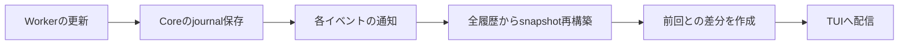

# Core受付停止への暫定対応とSurfaceでの会話組み立ての検討

2026年10月1日の通常利用で、長いthinking中にCoreのHTTPとキャンセル受付が応答しなくなった。
本書は、その原因調査と「暫定対応」「会話表示の組み立てを各Surfaceへ移す構造変更」の二本立て案、
通常レビューと批判的レビューの結果を保存し、後から設計を深く検討するための文書である。

両レビューは二本立てを止める強い理由を見つけなかった。ただし、暫定対応にはキャンセル受付自身の
重い履歴処理も含める必要があり、Surface移行は会話データの関連と順序を導出する処理として具体化する
必要がある。レビューはCore内の増分更新も対策になると評価しており、Surface移行の価値は別に評価する。

観測日は2026年10月1日で、本書への整理・保存は2026年10月2日に行った。
継続検討では、利用者と三段階の進め方に合意した。現在の方針は後段の「合意した三段階」を参照する。
本書は検討案とレビュー結果であり、採用済みincrementの計画ではない。具体的な実装方式は未決で、
この調査・レビューによるproduction sourceの変更はない。入口は
[通常利用メモのA28](../experience/normal-use-inbox.md)である。

## 利用者の目的と対象範囲

利用者が必要としているのは、長いthinking中でもHenjiの状態を確認し、キャンセルを受け付けられることと、
CoreとUIの責務分担を納得して選べることである。利用者は二本立て案の通常レビュー・批判的レビューと、
検討材料のファイル保存を指示した。

2.5GiBのメモリ内訳の追究は、利用者判断で対象から外した。WebUI本体、CLIのHTTP client化、
providerの自動再試行、色対応は今回の検討範囲に含めない。将来WebUIで同じデータを使える方向は考慮するが、
WebUIが実装済みであるとは扱わない。

## 確認した実行証拠

対象はSession `e71f582a`の長いthinkingを伴う実行である。thinkingの本文量だけでは受付停止を
説明できず、Core内の表示向けデータ再構築が重いことを確認した。

| 確認対象                            | 観測                                           |
| ----------------------------------- | ---------------------------------------------- |
| 最終thinking本文                    | 約37KB                                         |
| thinkingの途中記録                  | 450件                                          |
| 対象executionのsemantic payload     | 合計約8.3MB                                    |
| Coreでの会話等の全体再構築          | 1回の中央値約807ms                             |
| 1回の再構築での履歴取得             | executionEvents 34回、semanticOccurrences 33回 |
| 24回連続の再構築                    | 合計約19.6秒                                   |
| 隔離compiled Coreへのキャンセル要求 | 応答まで約18.85秒                              |
| 同じ再現中のhealth API              | 2秒でtimeout                                   |

隔離再現は、保存済み履歴のコピーとlocalhostの応答だけを使い、TUIを接続せずに行った。
ローカル応答は正常に完了し、外部provider呼び出しは0回だった。したがって、今回特定した
Core受付遅延はTUIの描画やproviderの異常がなくても成立する。

この再現ではキャンセル要求が実行完了後に受付処理され、返答は`idle`だった。
キャンセル成功の再現ではなく、受付が遅れて止めたい実行に間に合わなかったことを確認したものである。

本番履歴には約248秒の観測時刻gapがある。後述する同期再構築の繰り返しと整合するが、本番停止中の CPU
profileと実際のbatchサイズは取得していないため、gap全体の内部構成は断定しない。

調査artifactは [`diagnosis.json`](../../.tools/e71f582a-stall/diagnosis.json)、
[`compiled-results.json`](../../.tools/e71f582a-stall/compiled-results.json)、
[`projection_probe.ts`](../../.tools/e71f582a-stall/projection_probe.ts)にある。
これらはgit管理外のlocal証拠であり、上表はその主要な観測を本書に保存したものである。

## 現行経路と責務

### Coreで重くなっている経路

CoreはApplicationServiceのobservationごとに、Session全体のsnapshotを再構築する。
journalは最大256件の観測をまとめて保存するが、保存後は各イベントについて個別に通知するため、
保存済みの同じ全体データを繰り返し組み立てる経路になる。

再構築と差分生成はCoreで同期実行され、HTTPやキャンセルの受付と同じイベントループを使う。
更新が多いと、受付処理へ実行機会が戻るまで時間がかかる。

主要sourceは [`core_service.ts`](../../v0/agent/host/core_service.ts)の
`refreshSlotSnapshot`、`publishSnapshot`、observation subscription、
[`worker_host_journal.ts`](../../v0/agent/worker/worker_host_journal.ts)の `appendHistory`とbuffer
flush、 [`api_projection.ts`](../../v0/agent/host/api_projection.ts)の
`projectApplicationSession`である。

### TUIが既に担当している処理

現行TUIはHTTP/SSEのsnapshotと差分を受け取り、手元のsnapshotを更新し、表示entryを組み立てる。
Markdown、色、折り返し、viewport、表示cacheは既にTUI側の責務である。

したがって、案Bで新たに移す対象は描画そのものではない。Coreの`api_projection.ts`にある、
履歴から本文・thinking・tool・requestの関連と順序を導出する処理を対象として検討する。

主要sourceは [`reducer.ts`](../../v0/api/reducer.ts)の`reduceSessionStreamFrame`、
[`snapshot_presentation.ts`](../../v0/tui/snapshot_presentation.ts)の
`SnapshotConversationProjector`、
[`remote_session.ts`](../../v0/tui/remote_session.ts)の接続・再接続経路である。

### CLIのstream出力との関係

`henji run --stream`は独立したheadless Host経路で、HTTP Coreへ接続しない。
Workerの本文更新をCLI向けイベントへ変換し、本文差分をstdoutへ順番に出す。 この経路は、今回のHTTP
Coreでの全Session再構築を使わない。

方式の参考にはなるが、現在のCLIイベントをそのままTUIへ渡す案ではない。現行CLIイベントには
thinking、再接続、executionの採用・操作可能状態等の情報が足りない。
CLIとTUIで共有するイベントや変換処理を設計することと、CLIをHTTP clientにすることは別の判断である。

参照は [`runtime_cli.ts`](../../v0/agent/cli/runtime_cli.ts)、
[`run_events.ts`](../../v0/agent/cli/run_events.ts)、
[`worker_headless_runner.ts`](../../v0/agent/worker/worker_headless_runner.ts)である。

## 案A 受付停止への暫定対応

目的は、現行HTTP/SSE契約とCore-owned read
modelを維持しながら、表示向け処理による受付停止を解消すること。

レビューを受けた提案範囲は次のとおりである。

1. 保存batchや連続observationに対する表示更新を合流し、同じsnapshotの再構築を繰り返さない。
2. 一回の再構築内で、同じ履歴の取得・解析を使い回す。
3. キャンセル等の操作に必要な軽い状態取得を、会話履歴復元・全体再構築から切り離す。
4. command返答時の直接再構築も含め、操作受付を重い表示処理の完了待ちにしない。

合流するのは表示向けlistenerである。journalの保存と、実行制御へ事実を渡す通知は維持する。
例えばApplicationServiceは通知を先に`tasks.observe`へ渡し、steeringが実行へ渡った事実に基づいて
pending steeringを消す。この経路の通知までまとめて落とすと、pending表示が残る回帰につながる。

実行方式は未決である。単に`async`を付ければCPU処理が受付から分離されるとは仮定しない。
遅れて完成した表示データが最新の`cancelling`、`idle`、操作可能状態を巻き戻さない方法も決める。

完全な新read modelや新wire契約を最初から作ることは提案しない。既知の隔離再現で効果を判断し、
増分会話reducerまで必要になった場合は、案Bでも再利用できるpure TypeScriptの共通処理を検討する。

## 案B 会話表示の組み立てを各Surfaceへ移す

目的は、Coreが確定した事実と現在状態を供給し、Surfaceが会話表示用データを増分で組み立てる責務分担にすること。

| Coreに残す責務                                       | Surfaceへ移す責務                              |
| ---------------------------------------------------- | ---------------------------------------------- |
| Session、execution、selection、Workerとprocessの所有 | 会話表示用データの保持と増分更新               |
| semantic履歴の保存、実行結果と採用状態の確定         | 本文・thinking・toolの表示上の関連と順序の導出 |
| 操作可能状態、process cleanup完了等の現在状態        | Markdown、色、折り返し、viewport、表示cache    |
| event identity、順序、初回取得に必要な事実の提供     | 初回取得とイベントからの会話表示復元           |

Coreに残す事実の相関処理と、Surfaceへ移す表示上の導出処理の厳密な境界は未決である。
Surfaceは会話イベントから採用、実行終了、操作可能状態を推測しない。providerの本文終了、
履歴上のsettlement、process cleanup完了は同じ出来事ではないため、Coreが確定した状態を使う。

接続時は保存済み会話と最新の途中本文・現在状態を取得し、以後はイベントで更新する方向を検討する。
初回取得とlive feedを一つの境界で結ぶ必要がある。履歴GET後に独立して購読を開始するだけでは、
その間に起きた本文更新・thinking・settlementを取り逃す。

再接続で不足分を取得する方式と、現在状態を読み直す方式のどちらを採るかは未決である。 event
identity、順序、生成中本文の確定・停止への置換を含め、ライブ表示と再接続後の表示を一致させる。

TUIと将来WebUIが同じ会話組み立て処理をpure TypeScriptで共有するのは候補である。
この共有moduleの新設やWebUIの実装を、現段階で決定したものとは扱わない。

## 通常レビューの結果

判定は、案Aは実装計画へ具体化できる妥当な方向、案Bは成立する方向だが契約設計が必要、である。
以下は設計上の未決事項と、誤った選択をした場合の具体的な回帰であり、新規の実装済みbugとしてのfindingではない。

### キャンセル受付自身の履歴処理が残る

`executionRead`は実行状態取得時に履歴を読み、`query.currentSession().runtime`を使う。
この`currentSession`はruntime取得だけでも`restoreRecordMessages`によるSession履歴復元を伴う。
さらにキャンセル後には明示的な全体再構築がある。

通知回数を減らしても、キャンセル送信・応答がこの同期処理を待つ経路は残る。
案Aには操作に必要な軽い状態取得と重い会話表示取得の分離を含める。

参照は`core_service.ts`の`executionRead`と`cancelExecution`、
[`worker_tui_session.ts`](../../v0/agent/worker/worker_tui_session.ts)のquery bindingsである。

### 保存と実行制御への通知を合流しない

Coreの表示listenerを合流点とし、journal保存と`tasks.observe`はそのまま通す。
これは表示だけの最適化がsteeringやpendingの状態を変えないために必要である。

参照は [`application_service.ts`](../../v0/agent/host/application_service.ts)の`publish`、
[`task_service.ts`](../../v0/agent/host/task_service.ts)の`observe`である。

### 初回取得と更新購読の切れ目を定義する

現行SSEはsnapshotを先に送り、続いてpending updateを送る。clientはrevision gapを検出した場合に
snapshotを再取得する。案Bもこの接続・再接続のproduct動作を維持する必要がある。

生成中assistant本文はsemantic occurrenceとは別の最新stateなので、semantic履歴だけの取得では
復元できない。初回取得には最新本文stateも含める。

参照は [`server.ts`](../../v0/agent/http/server.ts)のSSE経路、 `remote_session.ts`のresync、
[`sqlite_history_v7_production_store.ts`](../../v0/agent/history/sqlite_history_v7_production_store.ts)の
assistant本文stateのreadbackである。

### 既存の意味イベントreducerをそのまま接続できない

`reduceSessionReadEvent`には意味イベントを増分適用する部品があるが、production TUIは
別の`reduceSessionStreamFrame`を使用している。

| 既存の意味イベント処理         | 現行表示側の依存                  | そのまま切り替えた場合 |
| ------------------------------ | --------------------------------- | ---------------------- |
| 途中本文はrequestsだけ更新する | 本文表示はmessagesから作る        | 途中本文が表示されない |
| thinkingには表示位置を付けない | 位置のないthinkingをskipする      | thinkingが表示されない |
| tool結果はmetadataだけ更新する | 結果行はtool role messageから作る | tool結果行が成立しない |

identityとupsertの部品は再利用できるが、増分会話組み立てと表示側の接続までを案Bのscopeに含める。
requestとtoolの識別、途中本文の確定・停止、steeringと未完thinkingの位置も扱う必要がある。

### Coreが確定する軽い現在状態を配信する

会話イベントだけでは操作可能状態やprocess cleanup完了の全状態を表現できない。
Coreがこれらを確定し、Surfaceへ軽い現在状態として渡す責務を維持する。

## 批判的レビューの結果

判定は、案Aは必要、案Bへの強い反対理由は見つからないが、停止解消の必要条件ではない、である。
以下は配置と費用対効果に関する設計判断である。

### 増分処理とSurface移行の効果を分ける

現在の問題は、Coreが会話データを持つことだけではなく、observationごとの同期的な全履歴再構築である。
Core内で会話データを増分更新しても、この原因は除去できるという設計上の評価である。
その最適化を実装して測定した結果ではない。

案Bの追加価値は、会話組み立てのCPU処理をCoreの制御受付から外し、Surfaceが接続していない間は
その処理を省けることである。総CPU使用量や、複数Surfaceを合わせた仕事量が必ず減るわけではない。
複数clientがそれぞれ組み立てる負担との比較は未計測である。

### 現行Surfaceの責務との違いを明確にする

現行TUIは既に差分を適用し、表示cacheやthinking・tool表示を組み立てている。
新しく移す対象は`api_projection.ts`にあるsemantic履歴から会話entity・関連・順序を導出する処理である。
「表示をSurfaceへ移す」だけの説明では、新設する処理と既存処理の区別が曖昧になる。

### 会話処理を移してもCoreの全履歴readが残る

`runtime.execution.requestCount`はexecution eventの取得から導出され、
`context.latestRequest`も全eventとcontext contentの取得・展開を伴う。
キャンセル受付にも同様の履歴取得がある。

案Bでconversationだけを移しても、これらの過去payload読出しを残せばCoreの受付には
履歴サイズに依存する負荷が残る。移行後に現在と同じ停止時間になるかは未計測であるが、
Coreに残す現在状態の取得方法は案A・案Bの両方で検討する必要がある。

### 二段階の重複作業を抑える

案Aで完全なCore内会話reducer・cache・初回復元を新設し、案Bで別の実装へ作り直すと重複が大きい。
まず合流、重複readの除去、操作受付との分離に絞る方向が提案された。

それで不足し増分reducerが必要になった場合は、共通pure moduleとしてCoreで先に利用し、
後でSurface側から利用する案がある。これは検討候補であり、現時点で実装方式を決定するものではない。

## 比較して決める選択肢

| 選択肢                        | 期待する利益                                                | 負担と未確認事項                                                             |
| ----------------------------- | ----------------------------------------------------------- | ---------------------------------------------------------------------------- |
| 案Aの局所修正                 | 現行契約を維持し、既知の受付停止を早く改善する              | 合流だけでは一回の全体再構築の重さは残る。操作経路も変更対象                 |
| Core内で会話データを増分更新  | 全履歴再scanを除去し、複数Surfaceへ同じ共通データを供給する | 会話組み立てのCPU処理はCoreに残る。案Bへ進む場合の重複を考える               |
| Surfaceで会話データを増分更新 | 会話の導出をCore受付から外し、UI側の責務を明確にする        | 初回・再接続・event契約と表示接続の設計が必要。複数Surfaceの合計負荷は未計測 |
| 共通pure moduleを段階的に移す | 会話組み立ての実装を案A・案Bで共有できる                    | moduleの入力・状態・所有者を決める。再利用できる分離になるかは未検証         |

この比較はレビューを受けた検討材料である。計測されていない速度向上や作業量を確定値として扱わない。
案Bへの賛成は、Core内増分方式を不適切と判断したことを意味しない。

## 2026-10-02の継続検討

以下はcoordinating agentによる追加調査と方式案であり、採用・実装承認ではない。
前節までの独立レビューを、この具体案へのレビュー済み判定として流用しない。

### 読み出し共有と実行場所の比較

既存の隔離履歴コピーをread-onlyで読み、productionの`projectApplicationSession`を呼ぶ
診断を追加した。production source、実DB、稼働Coreへの変更、外部provider callはない。
通常利用メモへの新規観測ではなく、既知の観測を説明する追加のlocal実験である。

最初の比較は、現行queryと、再構築一回の中だけquery結果を共有するqueryを各5回実行した。
共有側では`restoreRecordMessages`とprojectionも同じ`sessionHistory`を使う。
再構築をまたぐcacheや増分reducerは設けていない。

| 比較対象                   | 再構築の中央値 | executionEventsの取得回数 | semanticOccurrencesの取得回数 |
| -------------------------- | -------------- | ------------------------- | ----------------------------- |
| 現行query                  | 約803ms        | 34                        | 33                            |
| 同一再構築内の読み出し共有 | 約310ms        | 11                        | 11                            |

cursorを固定した生成snapshotのJSONは全回で一致した。共有後にも全executionの履歴解析が
残るため、通知合流と共有だけで受付停止がなくなるとは判断できない。

次の比較では、共有付き再構築を同じイベントループで行う場合と、別のDeno Workerで read-only
DB取得から行ってsnapshotを返す場合を各5回実行した。Workerは事前起動した。
受信側でsnapshot差分を作る時間も含め、5msタイマーが再構築中に動けるかを測った。

| 比較対象           | 再構築の中央値 | 呼出開始から受信までの中央値 | 各回の最大タイマー間隔の中央値 |
| ------------------ | -------------- | ---------------------------- | ------------------------------ |
| 同じイベントループ | 約280ms        | 約280ms                      | 約290ms                        |
| 別Worker           | 約274ms        | 約295ms                      | 約6.8ms                        |

別Worker時の各回の最大間隔は約6〜14msで、生成snapshotは同じだった。
これは処理量の削減より、Coreに相当する呼出側へ実行機会を残す効果を示す。
HTTP応答・キャンセル、Worker起動時間、live DBでの読取整合性、compiled executableへの組込みを
確認した実験ではない。修正後のproduction性能の保証や応答時間の受入値には使わない。

診断sourceと結果はgit管理外の
[`shared_read_comparison_probe.ts`](../../.tools/e71f582a-stall/shared_read_comparison_probe.ts)、
[`shared-read-comparison-results.json`](../../.tools/e71f582a-stall/shared-read-comparison-results.json)、
[`projection_execution_comparison_probe.ts`](../../.tools/e71f582a-stall/projection_execution_comparison_probe.ts)、
[`projection_execution_worker.ts`](../../.tools/e71f582a-stall/projection_execution_worker.ts)、
[`projection-execution-comparison-results.json`](../../.tools/e71f582a-stall/projection-execution-comparison-results.json)。

### 案Aの実行方式の暫定推奨

現時点では、通知合流・読み出し共有・軽い操作状態の分離に、重い読取とprojectionの別Worker実行を
組み合わせる案を推奨する。Core内の全会話増分reducerを案Aで作り切ることは提案しない。

| 実行方式                             | 判断材料                                                                                             |
| ------------------------------------ | ---------------------------------------------------------------------------------------------------- |
| 同期処理をtimerへ延期                | 通知合流には使えるが、実行中の約0.3秒の占有は残る                                                    |
| 読取・導出を分割して途中で制御を返す | 成立候補。ただし既存の同期queryとDB解析も分割しないと、外側でyieldするだけでは足りない。効果は未測定 |
| 別Workerで読取・導出                 | 上記local実験が受付側の実行機会を残す効果を支持する。読取境界と状態合成、配布への組込みが追加作業    |

具体案はCoreあたり一つの表示用Workerを置き、一度に一件を処理する。observation listenerは
更新要求だけを記録し、実行中に来た追加要求は次回へ合流する。journal保存と`tasks.observe`は
従来どおり個別に通す。microtaskだけの連鎖で次回処理を繰り返す方式は採らない。

重い履歴をCoreで読み出してからWorkerへ丸ごと渡すと、解析とcloneの占有が受付側に残る。
Worker自身がread-onlyで保存済み事実を取得し、Coreからは現在状態に必要なdataを渡す方向とする。
初回表示とinactive Sessionの読取も同じ重い経路に含める。現行storeは複数の読取ごとにDBを開くため、
既存queryの単純移植だけでは一つの読取境界を保証できない。live読取の境界は実装計画前に具体化する。
新規SessionのDB未作成時と`persistence: none`のtranscriptは今回の固定履歴実験に含めていない。
これらも現行の入口として計画で扱い、保存Sessionが存在することを新しい利用条件にしない。

Core側には現在の操作状態の軽い取得を設ける。元になる値は既に
`HostActiveSession.runtimeSnapshot()`、`ApplicationTaskService`のbusy/preparing、active execution、
pending、executionStatesにある。`query.currentSession()`全体をcacheする案ではなく、
transcriptのcloneと`restoreRecordMessages`を呼ばずに取得できるqueryへ責務を分ける。
ownerのpreparing/settling合成は現在のApplicationServiceの意味を維持する。

キャンセル対象の照合にはactive executionのidentityと軽いexecution metadataを使い、
完全な`executionRead`を経由しない。inactive executionへの現行の`idle`応答も維持する。
キャンセル通知・command返答・Coreのphase更新は表示Workerの完了を待たせない。
操作のcursorは実際に公開した状態のrevisionを返し、未完成projectionのrevisionを先に返さない。

遅い結果はruntime、operations、pending、selection、executionの採用・cleanup状態へ上書きしない。
Workerからの会話候補とCoreが確定する現在状態の更新経路を分け、公開時に現在のexecution headerを
会話側にも反映する。Session slotの切替後に旧slot向け結果を適用しない。
一方、更新が続くという理由だけで全結果を捨てると長いthinking中に何も表示されなくなるため、
同じSessionの完了済み会話候補は公開し、合流した次回更新で追いつく方式を検討する。
読取時点・途中本文の版・settlementとの関係は、この合成方式で残る具体的な未決事項である。

`requestCount`と`context.latestRequest`も表示更新のたびの全payload取得から外す。
前者は`provider_request_start`、後者はcontext requestのheaderから更新できる軽いread
stateを候補とする。
初期化はmetadata取得または表示Worker側の初回scan、live中はappend等の事実で更新する。
既存の`requestCount()`はgenerationの累積値なので、executionごとのAPI値へ単純に置換しない。
`/context`やAgent向けcontext projectionの内容取得は保持し、表示用summary取得と分ける。

### 案Bのデータ境界の具体案

案BでもCoreのread modelを全廃するわけではない。操作、採用、lifecycle、selection、現在状態と
履歴取得のread modelはCoreに残し、会話の表示entityと順序のread modelをSurfaceへ移す。

| 項目            | Coreから渡すもの                                                      | Surfaceで導出するもの                                 |
| --------------- | --------------------------------------------------------------------- | ----------------------------------------------------- |
| execution       | stable identity、task、turn、結果、採用、process settlement           | 人間向けattemptの並びと表示                           |
| requestと本文   | execution/lane/modelStep/requestOrdinal、本文と確定状態、元の順序     | 途中本文を置換するassistant行                         |
| thinking        | request identity、kind、本文、complete、元の順序                      | 会話内の挿入位置。数値message indexはwireへ固定しない |
| tool            | semantic identity、request参照、call/result関係、引数・結果・progress | call行とresult行、表示summary、本文との配置           |
| steering        | Hostが観測した受渡し事実、identity、元の順序                          | 該当attempt内のuser行                                 |
| runtime/pending | Core確定のphase、operations、pending、cleanup状態                     | footer等への表示。会話から実行終了を推測しない        |

Coreは既に確定したidentityと因果関係を供給し、表示順序のための仮想messageを作らない。
現在の履歴に明示参照がない箇所のrequest/tool対応は、sourceが使う対応規則を整理する必要があり、
未確認の対応を新しい確定事実として扱わない。 Surface共通のpure
moduleは、上表の入力から会話表示用stateを作る範囲に限定する。 HTTP、DB、操作受付、model context
projection、terminal rendererはそのmoduleへ入れない。

接続契約の暫定推奨は、現在と同じく最初に全量取得し、以後live更新を適用し、再接続では
全量を読み直す方式である。保存済み差分の再送、永続delivery log、旧wireとのdual対応は提案しない。
会話全量の組み立てはSurfaceで行い、Coreの初回取得は事実と最新stateを返す。

初回処理では、live更新の購読を確立してから読取境界を取り、読取中の更新を保持し、
bootstrapを先に返した後、その境界より新しい更新を返す。これは手順案であり、既存の
`subscribeSession`をそのまま非同期化して成立するとは扱わない。DB読取境界とlive stateの版を
結ぶ仕組みが必要で、採用計画でcontractを定める。

feedの順序はCore epoch/Session内のdelivery revision、保存事実のidentityはsemantic occurrence ID、
requestや途中stateはrequest identityと版で扱う。semantic ordinalとphysical event ordinalは
別なので同一視しない。異なるexecution間の順序をexecution内ordinalだけで決めない。
重複はidentityによるupsert、delivery gapは再bootstrapで処理する候補とする。

未保存の本文・thinking・progressをlive表示したことはdurable保存やcanonical採用を意味しない。
保存後の同じ更新で二重の行を作らず、request単位の途中本文を確定本文へ置換する。
`HistoryAppendResult.semanticOccurrenceId`がない途中本文更新も現行sourceに存在するため、
全live更新にsemantic occurrence IDがあるという契約は作れない。
bootstrapにはsemantic履歴に加え、保存済みassistant本文stateと、その時点でCoreが保持するlive stateを
含める。再接続後に復元できる未保存stateはCoreがまだ保持しているものに限り、Core再起動後の復元と
同じ保証にしない。現行Coreが保持していないlive値は、案Bの採用範囲に応じて所有者を決める。

### 合意した三段階

利用者は次の三段階を提示し、その後、各段階の条件三点へ明示的に同意した。
従来の案A/案Bの二本立てを、この順序へ具体化する。三段階の進め方と条件は合意済みであり、
個別incrementの詳細計画・実装方式・正本変更はこれから具体化する。

| 段階 | 対策                                                                    | 合意した条件                         | product上の確認                                                 |
| ---- | ----------------------------------------------------------------------- | ------------------------------------ | --------------------------------------------------------------- |
| 1    | 元の暫定案。重い会話組み立てとその履歴読取を別Workerへ移す              | キャンセル経路の軽量化も含める       | 長いthinking中も状態確認とキャンセルが間に合う                  |
| 2    | APIとCLI SurfaceをWorkerへ分離し、Coreの通信・入出力機能を外す          | 段階1の組み立てWorkerを維持する      | HTTP/SSEとCLIの`--stream`が成立し、組み立て中も操作を受け付ける |
| 3    | 組み立て機能を見直し、TUI・API・CLI・組み立てWorkerの責務分担を変更する | 組み立てWorkerの存廃も含めて判断する | live表示・履歴復元・再接続と実行状態が一貫して成立する          |

段階1は通知合流、同一projection内の読取共有、軽い現在状態の取得、操作返答時の重い再構築の
分離を含める。既知の隔離compiled再現でhealthが応答し、まだ実行中のrequestへcancelが届くこと、
TUIで本文・thinking・tool・steering・phaseが成立することを確認する。タイマー実験で代替しない。

段階2では重い組み立てをAPI Workerへ同居させない。CLI Worker化はHTTP client化や常駐Coreへの
接続必須化とは別であり、共通operation/observation境界をheadlessとHTTPの両経路へつなぐ方法を決める。
組み立てWorkerは新しい永続状態の所有者にせず、現在の会話機能を保持して配置を変える。

段階3では、共通の意味処理を組み立てWorkerへ残す案、各Surfaceで共有moduleを使う案、
APIが供給する事実・read modelの範囲を比較する。全部をTUIへ移すことや組み立てWorkerの廃止を
事前に固定しない。前節までの案Bのデータ境界・再接続方式は、この段階への検討入力であって
採用済みcontractではない。段階1/2の処理を何に再利用し何を廃止するかもここで判断する。

対象increment番号、応答時間の受入値、具体的なWorker構成・起動終了方式、段階3の責務配置と
architectureの意味変更は未決である。

### 利用者の方向づけとCoreの絞り込み

継続会話で利用者は別Worker実行に賛成し、APIサーバーごと別Workerへ移す案を提示した。 さらに「CLI
Surfaceもworkerにしてもいい」「コアの機能を絞る」と方向づけた。
その後、上記三段階と条件へ合意した。具体的な構成・increment・実装の包括承認とは扱わない。

Coreを実行制御と状態所有に絞る責務案は次のとおり。

| Coreに残すもの                                                | Surface・adapter側へ置くもの                               |
| ------------------------------------------------------------- | ---------------------------------------------------------- |
| Session/execution/selectionの所有、操作受付と実行可否の判断   | 人間の入力をoperationへ変換する処理                        |
| Agent Worker・child・tool processのlifecycle、cancelとcleanup | CLIのstdin/stdout/stderrと`--stream`の本文差分・tool要約   |
| semantic保存とcanonical採用、結果の確定                       | 人間向け会話entity・関連・表示順序の導出、会話snapshot差分 |
| 現在状態とidentity・順序・因果関係を持つ事実の提供            | HTTP route、JSON化、SSE配信と接続管理                      |

Coreは既存のWorker commandをSurfaceへ直接公開するのでなく、現在と同じapplication operationの
意味を所有する。Surfaceとadapterはdata-onlyの操作要求・返答・観測をWorker境界で交換する案とする。
Agent向けmodel contextの意味とcanonical入力は表示処理と区別し、Surfaceへ移管しない。

現行`henji run --stream`は独立headless Hostからの直接イベント出力であり、HTTP経由ではない。
CLIをWorkerへ置くこととHTTP client化は別の選択である。今回の追加検討は前者を含め、
後者は引き続き対象外とする。CLIも共通operation/observation境界を使う案を検討するが、
現在のCLIイベントだけではthinking・再接続等の会話入力を満たさない。

API Worker内で同期の全履歴再構築を実行すると、Coreは動けてもHTTPのキャンセル受付が待たされる。
APIのWorker化と、重い組み立てから操作受付を分離することは別に成立させる必要がある。
段階2では組み立てWorkerを併用する。段階3ではAPIが事実を配信する案も候補とする。
具体的な起動・終了・配布方式と、共通境界をheadless/HTTP両経路へ接続する範囲は未決である。

## 次に決める事項

最新の議論は[追加検討文書](a28-three-stage-review-and-reference-comparison-2026-10-02.md)の
「継続議論の保存: 元データの所在・中継・表示用schema」を参照する。
WorkerによるSQLite直接読取、Coreを経由しない会話配送、表示元データの増分保存と既存tableの再利用を
比較候補として保存した。schema・直接配送の採用や実装は未決である。

当面は段階1の1〜2に加え、4〜6のうち現行snapshot契約を非同期Workerで維持するための
読取・公開・初回購読境界を具体化する。新しいfact feedや意味処理の配置変更は段階3の検討入力とする。
独立した三段階案の通常・批判的レビューとPi・Cloudflare Agents比較は
[追加検討文書](a28-three-stage-review-and-reference-comparison-2026-10-02.md)を参照する。

1. 段階1で表示更新をどこで合流し、重い再構築をどう実行するか。 操作受付とWorker
   lifecycleを待たせず、古い結果で最新状態を戻さない方式を決める。
2. 操作・runtime・context取得に必要な軽い状態を、過去payloadの全scanなしでどう取得・更新するか。
3. 案BでCoreからSurfaceへ移す導出処理の範囲と、Coreに残す事実の相関処理を決める。
4. 初回取得とlive feedの境界、cursor、event identity、順序、重複適用の扱いを決める。
5. 未保存のライブ更新と保存済み状態の関係を決める。表示されたこととdurable保存を同じ意味にしない。
6. 途中本文、thinking、tool結果、steering、実行状態が、ライブ中と再接続後の両方で成立する
   会話組み立て処理を決める。
7. 案Aで増分reducerまで必要になった場合、案Bへ再利用する範囲を決める。
8. 各段階のincrement scopeと、段階2のAPI/CLI共通境界、段階3の責務配置を決める。

追加レビューで、段階1はcancel対象の照合だけでなく、Host runtime通知・journal通知・操作可否・
返答までの同期再構築を外す必要を確認した。DB読取中のlive状態との対応、古い結果の扱い、
公開revisionの単一owner、初回・再接続のsnapshotと購読の対応も段階1で決める。
段階2の主目的は、開発agentがAPI・CLI固有処理をCoreへ混ぜ込むことを防ぎ、Worker境界と
明示した操作・観測interfaceで責務を維持することである。利用者がこの理由を明示した。
追加の性能効果は未測定だが、性能改善の有無を段階2の採否条件にはしない。
利用者は追加コピーによる性能劣化の事前確認を指摘した。保存履歴の隔離診断ではAPI Workerへの
追加配送とSSE形式のJSON化による増分は初回snapshot約0.73ms、最長thinking更新約0.064msだった。
HTTP・UI・Worker起動を含む性能は未確認で、段階2の切り替え前に現行利用経路と比較する。
詳細は追加検討文書の「段階2のコピー負担の事前診断」を参照する。

実装後の確認では、既知の隔離再現でキャンセルとhealthの遅延が改善したかを確認する。
TUI変更は隔離XDG・tmux上のproduction経路で表示と操作を確認する。
これらは検討中の確認方針であり、修正後の性能や表示が検証済みであることを意味しない。
実provider呼び出しが必要になった場合は、対象・回数・保存先を示して別途承認を得る。

## 正本と承認の境界

現行の [Host Worker architecture](../architecture/henji-host-agent-worker.md)は、
Session・execution・selection・履歴・read modelをCore-ownedとしている。 会話read
modelの責務をSurfaceへ移す案Bは、その担当領域の意味上の変更になる。

本書と通常利用メモへの保存は検討材料の記録である。architecture、構想、roadmapの変更は行っていない。
案Bを採用して正本を変更する際は、
[AGENTS.md](../../AGENTS.md)に従い、対象・理由・意味上の変更内容を提示して明示承認を得る。
旧形式のmigration、dual-read/write、fallback、既存data削除を、この案から推測で追加しない。

## レビューの範囲と未確認事項

通常レビューは現行の実行・保存・配信・再接続・TUI表示経路のcorrectnessを確認した。
批判的レビューはSurface移行の必要性、Core内増分方式という代案、残留負荷、二段階の重複作業を確認した。
両レビューは独立したread-onlyレビューとして行った。

レビューではsourceと既存の調査artifactを確認し、fresh実行、full gate、外部provider call、
稼働Coreへの介入は行っていない。修正後の性能、案Bの初回復元性能、複数Surface時の負荷、 production
TUIでの移行後の表示・操作は未確認である。

構造化したレビュー要約は
[`review-results.json`](../../.tools/core-surface-two-track/review-results.json)にある。 このlocal
JSONや一時的なreview contextがなくても検討を再開できるよう、
判断材料と未決事項は本書と通常利用メモに保存した。
